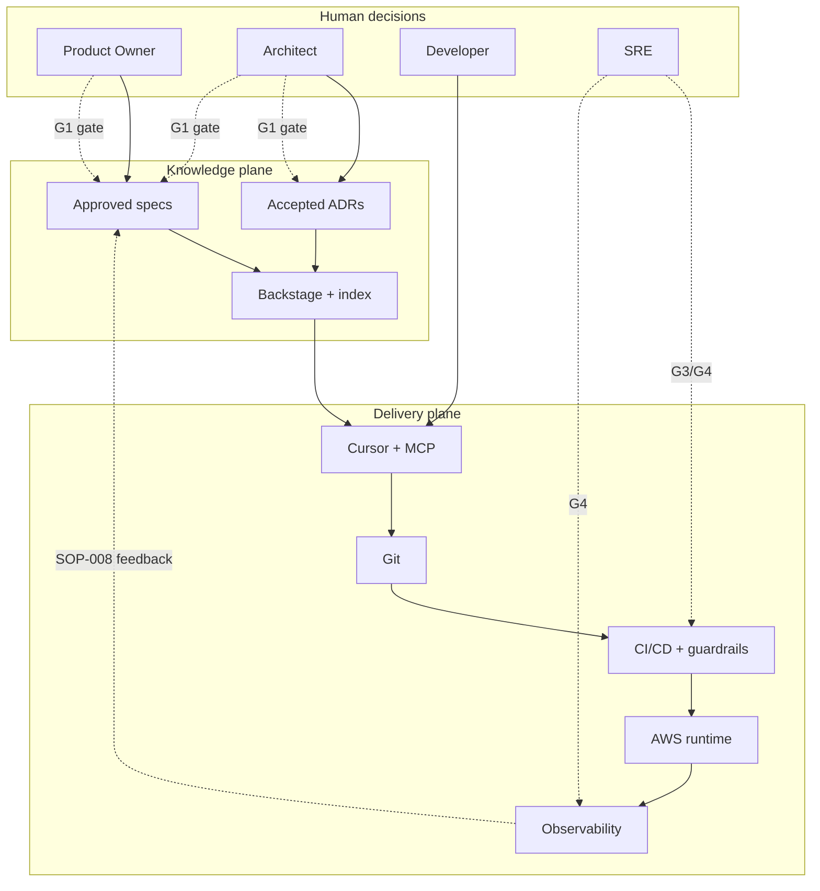
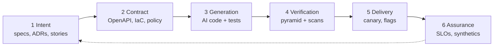
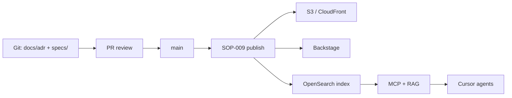
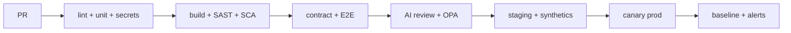
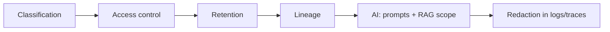
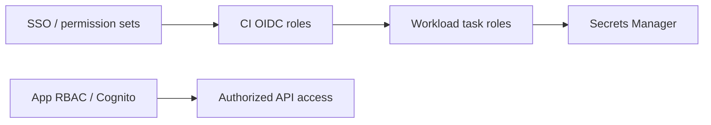
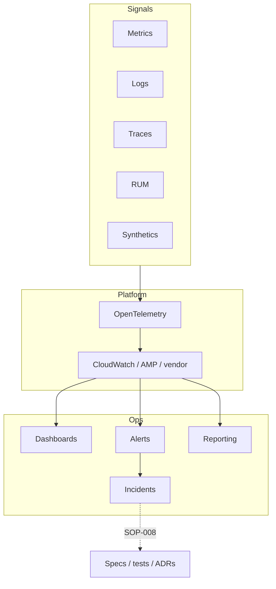
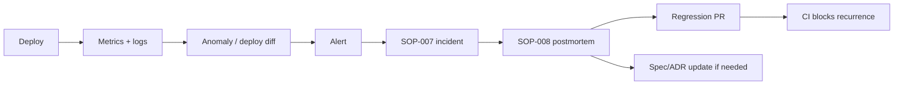
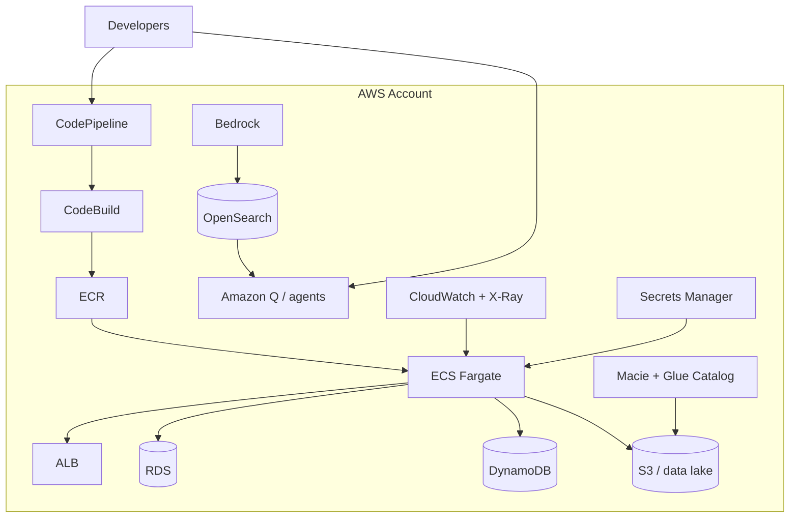

# Enterprise AI-Native Architecture on AWS

**Reference architecture — conceptual only.** No deployable artifacts live in this repository.

- **Compare options:** [Decision guides](guides/README.md) (pros, cons, pitfalls)  
- **Who decides:** [GOVERNANCE.md](GOVERNANCE.md) (adapt to your org)  
- **How to operate:** [processes/overview.md](processes/overview.md) · [sops/](sops/README.md) (reference playbooks)

---

## Executive summary

Six layers flow left to right; monitoring feeds back to planning:

**Intent → Contract → Generation → Verification → Delivery → Assurance**

AI accelerates layers 1–3 and parts of 4. Layers 4–6 are predominantly automated. Humans hold decision rights at architecture approval, contract approval, PR review, Tier-1 deploy, and incident command.

---

## 1. System context

**SOP mapping:** Planning = SOP-001–003 · Build = SOP-004–005 · Release = SOP-006 · Operate = SOP-007–008

---

## 2. Layer model

| Layer | Primary AWS | Primary tools | Human gate |
|-------|-------------|---------------|------------|
| 1 Intent | Bedrock | Jira, planning agent | ARCH + PO ([SOP-002](sops/SOP-002-adr-lifecycle.md), [SOP-003](sops/SOP-003-spec-approval.md)) |
| 2 Contract | — | OpenAPI, CDK, OPA | ARCH |
| 3 Generation | Q, Bedrock | Cursor, MCP | — |
| 4 Verification | CodeBuild, Inspector | pytest, Playwright, ESLint/Ruff, Semgrep | Reviewer ([SOP-005](sops/SOP-005-pr-review.md)) |
| 5 Delivery | CodeDeploy, AppConfig | CodePipeline, ECR | SRE T1 ([SOP-006](sops/SOP-006-release-deploy.md)) |
| 6 Assurance | CloudWatch, X-Ray | Synthetics, EventBridge | SRE ([SOP-007](sops/SOP-007-incident-response.md)) |

---

## 3. Tooling: primary vs optional

See [guides/README.md](guides/README.md) for full alternatives and pitfalls. Summary:

| Category | Often start with | Also consider |
|----------|------------------|---------------|
| IDE AI | Cursor + MCP | Amazon Q, Copilot |
| Planning AI | Bedrock (VPC) | Custom agents |
| ADR / spec store | Git | Backstage, OpenSearch — [guide](guides/knowledge-indexing-portals.md) |
| Linters & static analysis | ESLint/Ruff + pre-commit + Semgrep | [guide](guides/static-analysis-linting.md) |
| CI/CD | CodePipeline or GitHub Actions | [guide](guides/ci-cd-release.md) |
| Runtime | ECS Fargate + Lambda | EKS if required — [guide](guides/runtime-aws.md) |
| Data governance | Macie + Glue catalog + classification ADR | [guide](guides/data-governance.md) |
| Observability signals | OTel + CloudWatch + X-Ray | [guide](guides/monitoring-tracing-logging.md) |
| Dashboards & reporting | AMG / CloudWatch + SLO reports | [guide](guides/dashboards-reporting.md) |
| Incident management | PagerDuty + runbooks | [guide](guides/incident-management.md) |
| Monitoring as QA | Synthetics + deploy diff | [guide](guides/observability-monitoring-qa.md) |

Avoid adopting every tool at once. Roll out by lifecycle phase ([processes/overview.md](processes/overview.md)).

---

## 4. Knowledge plane (ADR & specs)

Non-production artifacts live in Git, publish on merge, index for humans and agents.

**Rules:** Only `accepted` ADRs and `approved` specs are indexed. See [planning-and-adr.md](planning-and-adr.md) and [SOP-009](sops/SOP-009-artifact-publish.md).

---

## 5. Verification model

**Automated verification standard** (not "zero QA"):

| Activity | Automated | Human |
|----------|-----------|-------|
| Unit / contract / E2E tests | CI runs all | Reviews test quality in PR |
| Security / policy scans | CI blocks | SEC exceptions via [SOP-012](sops/SOP-012-exception-handling.md) |
| AI diff review | CI advisory or rule-based | Reviewer reads summary |
| Staging behavior | Synthetics + metrics | PO demo sign-off ([SOP-006](sops/SOP-006-release-deploy.md)) |
| Production health | SLOs + canaries | SRE incident command |

Detail: [qa-guardrails.md](qa-guardrails.md) · [Linters & static analysis](guides/static-analysis-linting.md)

---

## 6. CI/CD & observability (summary)

Tier-specific gates: [GOVERNANCE.md](GOVERNANCE.md) · Pipeline detail: [cicd-observability.md](cicd-observability.md) · Procedure: [SOP-006](sops/SOP-006-release-deploy.md)

---

## 7. Data governance (cross-cutting)

Spans planning through operations — especially critical with AI prompts and RAG.

Detail: [data-governance.md](data-governance.md) · [Guide: Data governance layers](guides/data-governance.md) · [Identity, access & secrets](identity-access-secrets.md)

---

## 7b. Identity, access & secrets (cross-cutting)

Workforce SSO, CI OIDC, task roles, application RBAC, and secret lifecycle span build through operate.

Detail: [identity-access-secrets.md](identity-access-secrets.md) · [Guide: Identity, access & secrets](guides/identity-access-secrets.md)

---

## 8. Operations & observability stack

| Concern | Guide |
|---------|-------|
| Instrumentation | [monitoring-tracing-logging.md](guides/monitoring-tracing-logging.md) |
| Dashboards & SLO reports | [dashboards-reporting.md](guides/dashboards-reporting.md) |
| Incidents & on-call | [incident-management.md](guides/incident-management.md) |
| Monitoring as QA loop | [observability-monitoring-qa.md](guides/observability-monitoring-qa.md) |
| Umbrella topic doc | [operations-observability.md](operations-observability.md) |

---

## 9. Monitoring feedback loop

**Hard rule:** Sev-1/2 requires regression test merged within 48h / 5 days respectively ([SOP-008](sops/SOP-008-post-incident.md)).

---

## 10. Human-in-the-loop (decision map)

| Gate | Approver | SOP |
|------|----------|-----|
| ADR accepted | ARCH | SOP-002 |
| Spec approved | ARCH + PO | SOP-003 |
| PR merged | DEV reviewer + CI | SOP-005 |
| Staging OK | PO (user-facing) | SOP-006 |
| Prod T1 deploy | SRE + ARCH | SOP-006 |
| Incident command | SRE | SOP-007 |
| Security exception | SEC | SOP-012 |

---

## 11. Velocity vs quality

| Risk | Mitigation |
|------|------------|
| AI hallucinates APIs | Approved spec + contract tests |
| Architecture drift | Accepted ADRs in agent context + ARB |
| Weak tests | Mutation floor by tier |
| Review bottleneck | AI first pass; human spot-check |
| Prod regressions | Deploy metric gate + mandatory regression loop |
| Knowledge silos | Git + Backstage + OpenSearch |

---

## 12. AWS reference topology

---

## Related documents

- [GOVERNANCE.md](GOVERNANCE.md) — RACI, tiers, artifact lifecycle
- [processes/overview.md](processes/overview.md) — value stream, ceremonies
- [sops/README.md](sops/README.md) — all procedures
- [data-governance.md](data-governance.md) · [operations-observability.md](operations-observability.md)
- [planning-and-adr.md](planning-and-adr.md) · [developer-workflow.md](developer-workflow.md) · [qa-guardrails.md](qa-guardrails.md) · [cicd-observability.md](cicd-observability.md)
