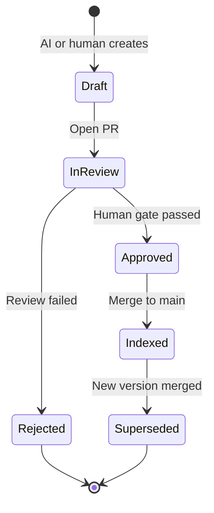
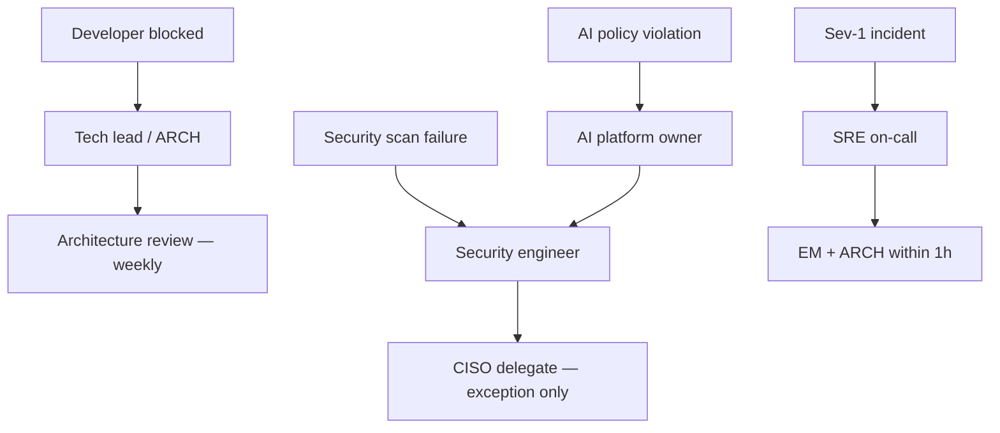

# Governance Model

**Reference model** — adapt roles, tiers, and gates to your organization. Record **your** choices in **your** project's ADRs.

Roles, decision rights, service tiers, and artifact lifecycle. SOPs in [sops/README.md](sops/README.md) are **playbooks to customize**, not procedures executed from this repo.

**Compare governance approaches:** [Guide: Human-in-the-loop](guides/human-in-the-loop-governance.md)

---

## Design improvements (from initial brainstorm)

The first draft listed tools and layers broadly. This revision tightens the model in six ways:

| Gap in brainstorm | Improvement |
|-------------------|-------------|
| Tool list without priority | **Primary vs optional** stack per layer (see [ARCHITECTURE.md](ARCHITECTURE.md)) |
| "Zero manual QA" overstated | **Automated verification standard** — no manual test execution; humans still review artifacts, PRs, and staging behavior |
| Human gates listed but not owned | **RACI + decision rights** below |
| ADR/spec flow described twice | **Single artifact lifecycle** with machine-readable status |
| No entry criteria for coding | **Implementation unlock** requires Approved spec + Accepted ADRs + security sign-off when applicable |
| Monitoring loop vague | **SLO-owned feedback** with mandatory regression artifact within 48h of Sev-1/2 |

---

## Roles

| Role | Abbrev | Primary responsibility |
|------|--------|------------------------|
| Product Owner | PO | Prioritize work; approve acceptance criteria and staging behavior |
| Architect / Tech Lead | ARCH | Approve ADRs, API contracts, cross-service design |
| Developer | DEV | Implement against approved spec; propose ADRs; review PRs |
| Security Engineer | SEC | Approve threat models; own policy exceptions |
| SRE / Platform | SRE | Deploy gates, SLOs, incident response, runbooks |
| AI Platform Owner | AIPO | Bedrock/Q/MCP config, prompt policies, agent audit |
| Data steward | DATA | Classification glossary, catalog quality, retention policy |
| Engineering Manager | EM | Escalation, capacity, exception approval (non-security) |

---

## RACI by lifecycle phase

| Phase | PO | ARCH | DEV | SEC | SRE | AIPO | DATA |
|-------|----|----|-----|-----|-----|------|------|
| Feature intake | **A** | C | I | C | I | — | C |
| Spec drafting (AI-assisted) | R | **A** | C | C | I | C | C |
| ADR approval | I | **A** | R | C | C | — | I |
| Implementation | I | C | **R/A** | I | I | C | I |
| PR merge | I | C | **R** (reviewer **A**) | I | I | — | — |
| Staging validation | **A** | I | R | I | C | — | — |
| Production deploy (Tier 1) | I | C | R | I | **A** | — | — |
| Production deploy (Tier 2–3) | I | I | R | I | **A** (automated) | — | — |
| Incident response | I | C | R | C | **A** | — | C |
| Post-incident artifacts | I | C | **R** | I | **A** | — | I |
| AI tool / data policy | I | C | I | **A** | I | **R** | C |
| Data classification change | C | C | I | **A** | I | C | **R** |

**R** = Responsible · **A** = Accountable · **C** = Consulted · **I** = Informed

---

## Decision rights

| Decision | Who decides | AI may recommend | Escalation |
|----------|-------------|------------------|------------|
| Business priority | PO | Yes (impact summary) | EM |
| API contract shape | ARCH | Yes (draft OpenAPI) | Architecture review board |
| Technology / pattern choice | ARCH (via ADR) | Yes (options analysis) | ARB if cross-team |
| Merge to main | DEV reviewer + CI | AI review advisory | ARCH if ADR conflict |
| Production deploy Tier 1 | SRE + ARCH | No | EM |
| Security policy exception | SEC | No | CISO delegate |
| Production data in AI prompts | SEC + AIPO | No | Always deny by default |
| SLO / alert threshold change | SRE | Yes (baseline analysis) | ARCH if customer-facing |

---

## Service tiers

Tier drives test rigor, deploy gates, and on-call expectations.

| Tier | Examples | Mutation floor | Prod deploy | On-call |
|------|----------|----------------|-------------|---------|
| **T1** | Auth, payments, PII | 85% | Manual approval + canary | 24×7 page |
| **T2** | Core APIs, order flow | 75% | Automated canary | Business hours + page |
| **T3** | Internal tools, batch | 60% | Automated | Best effort |

Tier is recorded in Backstage `catalog-info.yaml` and enforced in CI via labels.

---

## Artifact lifecycle

All planning artifacts use Git-managed status. CI enforces transitions.

### Spec status (`specs/openapi/*.yaml` → `info.x-status`)

| Status | Meaning | Blocks implementation PR |
|--------|---------|---------------------------|
| `draft` | Work in progress | Yes |
| `in-review` | PR open | Yes |
| `approved` | ARCH + PO signed off | No |
| `deprecated` | Replaced | Yes (use successor) |

### ADR status (`docs/adr/*.md` front matter)

| Status | Indexed for AI agents | Blocks implementation |
|--------|----------------------|------------------------|
| `proposed` | No | Yes (if decision required) |
| `accepted` | Yes | No |
| `rejected` | No | N/A |
| `superseded` | No (successor linked) | N/A |

### Implementation unlock checklist

Before a feature branch may merge implementation code:

- [ ] Linked spec is `approved`
- [ ] All referenced ADRs are `accepted` (or explicitly not required — logged in ticket)
- [ ] Threat model reviewed by SEC when tier T1/T2 and external exposure
- [ ] Ticket links spec, ADR IDs, and tier

CI label `implementation-unlocked` is applied by workflow when checks pass.

---

## Escalation paths

---

## Metrics & health (governance view)

| Metric | Target | Owner |
|--------|--------|-------|
| Spec approved before first impl commit | 100% | ARCH |
| ADR time-to-accept | ≤ 3 business days | ARCH |
| PR cycle time (median) | ≤ 1 day | EM |
| Main branch CI pass rate | ≥ 95% | SRE |
| Escaped defects (no prior alert) | Down quarter-over-quarter | SRE |
| Regression test added post Sev-1/2 | 100% within 48h | DEV |

---

## Related documents

- [Process overview](processes/overview.md)
- [SOP index](sops/README.md)
- [Architecture](ARCHITECTURE.md)
