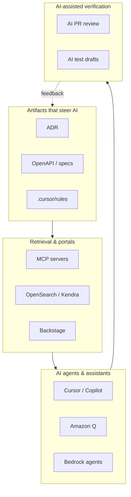

# AI toolkit catalog

One reference page for **AI tools** (models, agents, assistants) and **AI-adjacent tools** (ADRs, specs, MCP, portals) that shape how AI behaves in enterprise delivery.

::: tip How to use this page
Pick tools in [SOP-010](/sops/SOP-010-ai-tool-usage) and record **your** stack in **your** ADR. This repo compares options — it does not mandate a vendor list.
:::

---

## At a glance

| Name | Type | What it does | Lifecycle impact | Deep dive |
|------|------|--------------|------------------|-----------|
| **Cursor** | IDE agent | Multi-file coding agent, chat, `.cursor/rules`, MCP | **Build** — velocity; risk without spec/ADR context | [AI coding tools](/guides/ai-coding-tools) |
| **Amazon Q Developer** | IDE / AWS assistant | AWS API, IaC, service patterns inside AWS boundary | **Build** — AWS-heavy work; complements IDE agent | [AI coding tools](/guides/ai-coding-tools) |
| **GitHub Copilot** | IDE assistant | Inline completion, chat, PR integration | **Build** — broad adoption; less agentic than Cursor | [AI coding tools](/guides/ai-coding-tools) |
| **Bedrock (models)** | Managed LLM API | Claude, Titan, etc. via VPC endpoint | **Plan / Build** — planning agents, batch tasks | [AI coding tools](/guides/ai-coding-tools) · [SOP-010](/sops/SOP-010-ai-tool-usage) |
| **Bedrock agents** | Custom agents | Orchestrated tools + RAG for internal workflows | **Plan** — ADR/spec draft; not daily IDE replacement | [AI coding tools](/guides/ai-coding-tools) |
| **MCP** | Context protocol | `search_adr`, `get_spec` tools for IDE agents | **Build** — precise context; reduces hallucination | [Knowledge indexing](/guides/knowledge-indexing-portals) |
| **OpenSearch (RAG)** | Search index | Semantic + full-text over Approved artifacts | **Plan / Build** — agent retrieval at scale | [Knowledge indexing](/guides/knowledge-indexing-portals) |
| **Amazon Kendra** | Managed search | Enterprise connectors, Q&A over docs | **Plan / Build** — managed alternative to OpenSearch | [Knowledge indexing](/guides/knowledge-indexing-portals) |
| **Backstage** | Developer portal | Service catalog, TechDocs, ADR discovery | **Plan / Build** — human + agent discoverability | [Knowledge indexing](/guides/knowledge-indexing-portals) |
| **ADR (MADR)** | Architecture artifact | Records decisions; status `proposed` → `accepted` | **Plan** — gates implementation; agents read **Accepted** only | [Planning & ADR](/guides/planning-adr-specs) · [SOP-002](/sops/SOP-002-adr-lifecycle) |
| **OpenAPI spec** | API contract | HTTP operations, schemas, examples | **Plan / Build** — bounds AI codegen; contract tests | [Spec-driven dev](/guides/spec-driven-development) · [SOP-003](/sops/SOP-003-spec-approval) |
| **AsyncAPI** | Event contract | Events, channels, messages | **Plan / Build** — event-driven AI context | [Spec-driven dev](/guides/spec-driven-development) |
| **Protobuf + buf** | RPC contract | gRPC services, breaking-change checks | **Plan / Build** — typed codegen for gRPC shops | [Spec-driven dev](/guides/spec-driven-development) |
| **BDD / Gherkin** | Acceptance spec | PO-readable scenarios | **Plan / Verify** — acceptance; link to OpenAPI ops | [Spec-driven dev](/guides/spec-driven-development) |
| **Spectral** | Spec linter | Lint OpenAPI in CI | **Verify** — spec quality before agents consume | [Linters guide](/guides/static-analysis-linting) |
| **`.cursor/rules`** | Agent steering | Team conventions in repo | **Build** — consistency; must be PR-reviewed | [AI coding tools](/guides/ai-coding-tools) |
| **Bugbot / AI PR review** | Review bot | Diff review, advisory or blocking | **Verify** — catches issues; never replaces human | [AI guardrails](/guides/ai-guardrails-security) |
| **CodeGuru Reviewer** | AWS review | ML-powered Java/Python review | **Verify** — AWS-native advisory review | [AI guardrails](/guides/ai-guardrails-security) |
| **AI test generation** | Test drafts | Tests from OpenAPI + ADR context | **Verify** — speed; human must review assertions | [Automated testing](/guides/automated-testing-qa) |
| **Confluence / wiki** | Mirror portal | PM/legal friendly view | **Plan** — **mirror only**; stale if canonical | [Knowledge indexing](/guides/knowledge-indexing-portals) |
| **Local models (Ollama)** | Offline LLM | Snippets without cloud | **Build** — personal only; no proprietary code at scale | [AI coding tools](/guides/ai-coding-tools) |

---

## IDE agents & coding assistants

Tools developers use daily to write and refactor code with AI.

### Cursor

| | |
|--|--|
| **What it does** | IDE with multi-file agents, codebase index, MCP integration, `.cursor/rules` |
| **Impact** | Highest **Build** velocity when wired to Approved specs and Accepted ADRs; without context, increases architecture drift and invented APIs |
| **Phases** | Build (primary), Verify (via PR output) |
| **Roles** | DEV (daily), AIPO (enterprise config), SEC (data boundary) |
| **Risk if misused** | Prod data in prompts, unreviewed merges, ignored rules file |

### Amazon Q Developer

| | |
|--|--|
| **What it does** | AWS-aware assistant for IaC, service APIs, troubleshooting in AWS accounts |
| **Impact** | Speeds **Build** for AWS-native patterns; weaker as general app refactor agent |
| **Phases** | Build |
| **Roles** | DEV, SRE |
| **Pairs with** | Cursor or Copilot for non-AWS application code |

### GitHub Copilot

| | |
|--|--|
| **What it does** | Inline completion and chat; strong GitHub PR workflow |
| **Impact** | Low-friction **Build** assist; less multi-step agent workflow than Cursor |
| **Phases** | Build |
| **Roles** | DEV |
| **Fit** | GitHub-standard orgs starting with completion before agents |

### Local models (Ollama, etc.)

| | |
|--|--|
| **What it does** | Runs models locally without cloud API |
| **Impact** | Acceptable for learning/snippets; **not** for enterprise codebase at scale |
| **Policy** | [SOP-010](/sops/SOP-010-ai-tool-usage) — optional, no company code |

→ Compare all options: [Guide: AI coding tools](/guides/ai-coding-tools)

---

## Planning agents & AWS AI platform

Tools for **drafting** ADRs, specs, impact summaries — not replacing architect sign-off.

### Amazon Bedrock (foundation models)

| | |
|--|--|
| **What it does** | Managed LLMs (Claude, Titan, etc.) via API; VPC endpoints; CloudTrail logging |
| **Impact** | **Plan** — draft ADR options, summarize intake; **Build** — batch codegen tasks via gateway |
| **Roles** | AIPO (platform), ARCH (accept/reject drafts), SEC (logging & data tier) |
| **Governance** | Enterprise tier; prompt logging; no Restricted data ([Data governance](/guides/data-governance)) |

### Bedrock agents (custom)

| | |
|--|--|
| **What it does** | Agent orchestration with tools + knowledge bases |
| **Impact** | Internal **Plan** workflows (intake triage, ADR first draft); poor DX as daily IDE |
| **Roles** | AIPO builds; ARCH/PO consume outputs |

### Bedrock knowledge bases

| | |
|--|--|
| **What it does** | Managed RAG over S3/docs with Bedrock |
| **Impact** | Alternative to self-managed OpenSearch for **Approved** artifact retrieval |
| **Pitfall** | Indexing draft ADRs → agents implement rejected ideas |

→ [SOP-010](/sops/SOP-010-ai-tool-usage) approved stack · [AI guardrails](/guides/ai-guardrails-security)

---

## AI-adjacent artifacts (steer the models)

These are not LLMs — they **bound** what AI is allowed to assume and generate.

### ADR (Architecture Decision Record)

| | |
|--|--|
| **What it does** | Documents context, decision, status, consequences (MADR in `docs/adr/`) |
| **Impact** | **Plan** — implementation unlock requires **Accepted** ADR; agents must not read `proposed` |
| **Human gate** | ARCH accountable ([SOP-002](/sops/SOP-002-adr-lifecycle)) |
| **AI role** | Draft options only; architect sets `accepted` |

### OpenAPI / AsyncAPI / Protobuf

| | |
|--|--|
| **What they do** | Machine-readable contracts for HTTP, events, or RPC |
| **Impact** | **Plan** — Approved spec gates [SOP-004](/sops/SOP-004-implementation); **Build** — AI codegen target; **Verify** — contract tests |
| **AI role** | Generate implementation and tests **from** spec, not invent APIs |
| **Lint** | Spectral, buf breaking checks in CI |

### BDD / Gherkin scenarios

| | |
|--|--|
| **What it does** | Acceptance criteria in natural language |
| **Impact** | **Plan** — PO alignment; **Verify** — automated scenarios when linked to OpenAPI operation IDs |
| **AI role** | Draft scenarios from spec; human PO approves |

### `.cursor/rules` (and similar)

| | |
|--|--|
| **What it does** | Persistent instructions: naming, patterns, “always use Secrets Manager” |
| **Impact** | **Build** — reduces convention drift across agents |
| **Governance** | Version in Git; review in PR like code |

→ [Planning, ADR & specs](/guides/planning-adr-specs) · [Spec-driven development](/guides/spec-driven-development) · [Planning topic](/planning-and-adr)

---

## Context, retrieval & portals

How humans and agents **find** the right ADR, spec, or runbook.

### MCP (Model Context Protocol)

| | |
|--|--|
| **What it does** | Standard for tools agents call — e.g. `search_adr`, `get_openapi` |
| **Impact** | **Build** — precise retrieval vs pasting whole repos into chat |
| **Constraint** | Read-only; **Accepted/Approved** artifacts only |
| **Owner** | AIPO operates servers in **your** platform (not this repo) |

### OpenSearch / semantic index

| | |
|--|--|
| **What it does** | Full-text + vector search over ingested docs |
| **Impact** | **Plan / Build** — RAG at scale for agents and internal chat |
| **Constraint** | Ingest pipeline filters by ADR/spec status on merge |

### Amazon Kendra

| | |
|--|--|
| **What it does** | Managed enterprise search with connectors |
| **Impact** | Same as OpenSearch with less ops; higher cost at scale |

### Backstage + TechDocs

| | |
|--|--|
| **What it does** | Service catalog linking repo, ADRs, specs, runbooks |
| **Impact** | **Plan / Build** — discovery for humans; optional agent crawl source |
| **Canonical** | Git remains source; portal publishes on merge |

### Git (canonical store)

| | |
|--|--|
| **What it does** | Versioned `docs/adr/`, `specs/`, rules — PR-reviewed |
| **Impact** | Foundation for all retrieval; agents should prefer Git SHA or index synced from merge |

### Confluence / wiki (mirror)

| | |
|--|--|
| **What it does** | PM/legal-friendly view |
| **Impact** | **Plan** — communication; **never** canonical for agents unless one-way sync from Git |

→ [Guide: Knowledge indexing & portals](/guides/knowledge-indexing-portals) · [SOP-009](/sops/SOP-009-artifact-publish)

---

## AI-assisted verification

AI in **Verify** — advisory by default, blocking when tuned.

| Tool | What it does | Impact | Mode |
|------|--------------|--------|------|
| **Bugbot / AI PR review** | Comments on diffs, security smells | Catches issues humans miss; tune before blocking | Advisory → blocking |
| **Amazon CodeGuru Reviewer** | ML review for Java/Python | AWS-native second opinion | Advisory |
| **AI-generated tests** | Drafts from OpenAPI + ADR | Faster coverage; may encode bugs | Human review required |
| **Semgrep / CodeQL** | Not LLM — static rules | **Verify** — blocks Critical; complements AI review | Blocking |

**Impact on delivery:** Shortens review cycles but **does not** remove human reviewer ([SOP-005](/sops/SOP-005-pr-review)) or scan gates ([AI guardrails](/guides/ai-guardrails-security)).

---

## Impact by lifecycle phase

| Phase | AI tools & artifacts in play | Outcome if done well |
|-------|------------------------------|----------------------|
| **Plan** | Bedrock planning agents, ADR drafts, spec drafts, classification | Approved spec + Accepted ADR before code |
| **Build** | Cursor/Q/Copilot, MCP, rules, Approved OpenAPI | Fast implementation aligned to contracts |
| **Verify** | AI PR review, AI test drafts, Semgrep, gitleaks | Merge only when human + automation agree |
| **Release** | Minimal direct AI — CI/CD is deterministic | AI does not approve prod deploy |
| **Operate** | AI summarization for incidents (optional) | Postmortem drafts; human IC owns decisions |
| **Learn** | AI summarizes metrics for postmortem | Feeds spec/ADR/test updates next cycle |

→ Phase hubs: [Lifecycle](/lifecycle/)

---

## Impact by role

| Role | Primary toolkit touchpoints |
|------|----------------------------|
| **DEV** | Cursor/Q/Copilot, MCP, specs, rules, pre-commit |
| **ARCH** | ADR acceptance, spec approval, reject bad AI drafts |
| **AIPO** | Bedrock, MCP ops, Cursor enterprise, audit sampling |
| **SEC** | SOP-010 policy, scan gates, no Restricted data in prompts |
| **PO** | BDD acceptance, staging sign-off — not IDE agents |
| **QA** | AI test review, guardrail thresholds, monitoring-as-QA |

→ [Role perspectives](/perspectives/)

---

## Recommended enterprise stack (starting point)

| Layer | Default | Purpose |
|-------|---------|---------|
| **Daily coding** | Cursor (enterprise) + Amazon Q | App code + AWS/IaC |
| **Planning agents** | Bedrock via gateway | ADR/spec **drafts** only |
| **Canonical artifacts** | Git ADR + OpenAPI | Steer all agents |
| **Retrieval** | OpenSearch or Kendra + MCP | Accepted/Approved only |
| **Portal** | Backstage TechDocs | Human discovery |
| **Verify** | gitleaks + SAST + human PR + AI review advisory | Trust but verify |

Record **your** choices in **your** ADR — see [AI coding tools guide](/guides/ai-coding-tools) comparison tables.

---

## Pitfalls (catalog-wide)

| Pitfall | Affected tools | Mitigation |
|---------|----------------|------------|
| Tool sprawl | All IDE agents | Primary + optional in SOP-010; exception process |
| Draft ADR in RAG | OpenSearch, Kendra, MCP | Filter ingest by status |
| Spec optional | OpenAPI, agents | Strict for T1/T2 external APIs |
| AI replaces ARCH | Bedrock, Cursor | Human accepts ADR ([SOP-002](/sops/SOP-002-adr-lifecycle)) |
| Consumer AI tiers | ChatGPT personal, free Copilot | Enterprise agreements only |
| Rules file rot | `.cursor/rules` | PR review like code |
| AI review only | Bugbot | Human reviewer always ([Human-in-the-loop](/guides/human-in-the-loop-governance)) |

---

## Related

- [Guide: AI coding tools](/guides/ai-coding-tools) · [Knowledge indexing](/guides/knowledge-indexing-portals) · [Planning & ADR](/guides/planning-adr-specs) · [Spec-driven development](/guides/spec-driven-development)
- [SOP-010 AI tool usage](/sops/SOP-010-ai-tool-usage) · [Developer workflow](/developer-workflow) · [Glossary — MCP, ADR, RAG](/glossary)
- [Delivery pillar](/pillars/delivery) · [Build phase hub](/lifecycle/build)
