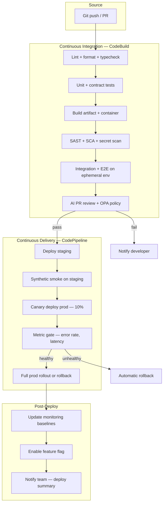
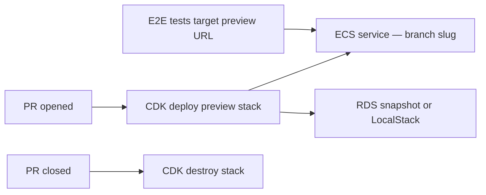
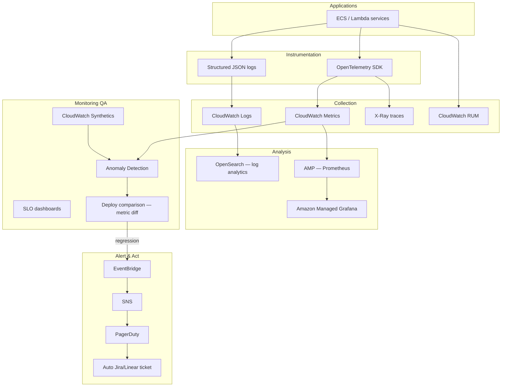
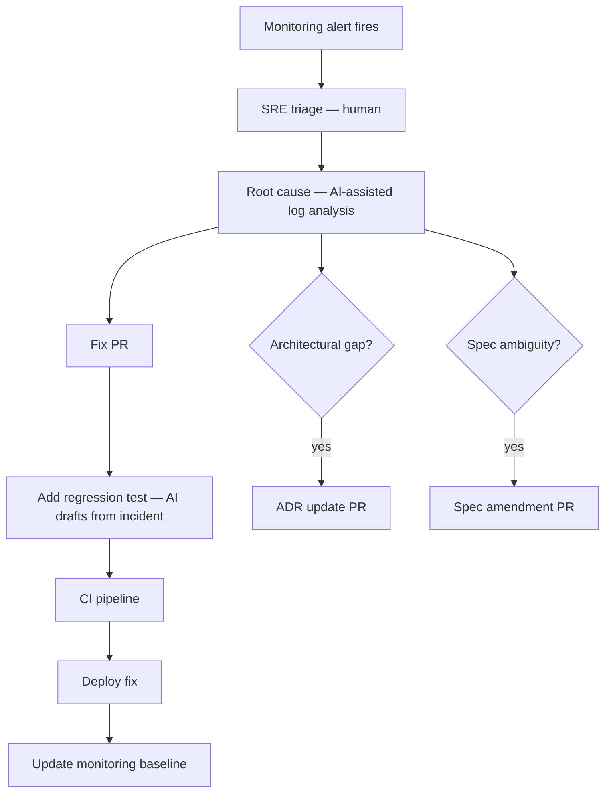

# CI/CD & Observability — Monitoring as QA

---
title: CI/CD & Observability
description: Pipeline design, automated scans, and monitoring-as-quality practices for CI/CD on AWS.
---

Pipeline design on AWS, automated scans at every stage, and a closed-loop observability system that treats production monitoring as continuous QA.

> **Reference template — no production code in this repo.**  
> **Operations cluster:** [operations-observability.md](operations-observability.md) · [Monitoring & tracing](guides/monitoring-tracing-logging.md) · [Dashboards](guides/dashboards-reporting.md) · [Incidents](guides/incident-management.md) · [Monitoring as QA](guides/observability-monitoring-qa.md)  
> **Procedures to adapt:** [SOP-006](sops/SOP-006-release-deploy.md) · [SOP-007](sops/SOP-007-incident-response.md) · [SOP-008](sops/SOP-008-post-incident.md)

---

## End-to-End Pipeline



---

## AWS CI/CD Component Map

| Stage | AWS service | Responsibility |
|-------|-------------|----------------|
| Source | CodeCommit / GitHub | Trigger pipeline |
| Build | CodeBuild | Compile, test, scan |
| Artifact | S3, ECR | Store builds and images |
| Orchestrate | CodePipeline | Stage sequencing |
| Deploy | CodeDeploy, ECS, EKS | Progressive rollout |
| Config | AppConfig | Feature flags |
| Secrets | Secrets Manager, SSM | Runtime credentials — see [Identity & access](identity-access-secrets.md) |
| IaC | CDK / CloudFormation | Ephemeral + prod stacks |

---

## Automated Scans by Pipeline Stage

| Stage | Scans | Fail condition |
|-------|-------|----------------|
| **Pre-commit** | gitleaks, lint, format | Local block |
| **PR — fast** | Unit, contract, secret | Any failure |
| **PR — build** | SAST, SCA, license | Critical/High |
| **PR — integration** | E2E, integration | Any failure |
| **PR — review** | AI diff, OPA | Policy violation |
| **Pre-deploy** | Container scan (ECR), IaC scan | Critical CVE |
| **Post-deploy staging** | OWASP ZAP (DAST), synthetic | Any critical finding |
| **Canary** | CloudWatch metric comparison | SLO breach |

---

## Ephemeral Environments

Each PR gets an isolated environment for integration and E2E tests:



- Naming: `preview-{pr-number}.{domain}`
- Cost control: auto-destroy after 24h idle or on PR close
- Data: synthetic fixtures only; never prod snapshots with PII

---

## Observability Stack on AWS



---

## Monitoring-as-QA: Alert Logic

Production monitoring is a **QA layer** that catches what CI missed.

### Alert types

| Alert | Detection | Action |
|-------|-----------|--------|
| **New error class** | Log pattern not in baseline allowlist | Ticket + page if Tier 1 |
| **Latency regression** | p99 > baseline + 2σ post-deploy | Auto-rollback if canary |
| **Synthetic failure** | Canary step fails | Page on-call |
| **SLO burn** | Error budget consumption rate | Freeze deploys |
| **Dependency failure** | X-Ray service map new red edge | Ticket with trace link |
| **Security signal** | GuardDuty finding | Security page |

### Deploy comparison (metric diff)

After each deploy, automatically compare (15 min window vs prior 24h baseline):

- Error rate by endpoint
- p50/p99 latency
- Saturation (CPU, queue depth)
- Business KPIs (orders/min, conversion)

If regression detected during canary → **automatic rollback** without human action. Human triage follows for root cause.

---

## Closed-Loop: Alert → Fix → Prevent



### Auto-ticket contents (AI-generated)

- Alert summary and timeline
- Deploy correlation (sha, time, author)
- Top relevant log lines and trace IDs
- Suggested root cause (labeled as hypothesis)
- Link to runbook
- Draft regression test stub

---

## Human-in-the-Loop: Operations

| Event | Automated | Human |
|-------|-----------|-------|
| Canary metric regression | Rollback | Review post-incident |
| New error class alert | Ticket created | Confirm severity, assign |
| SLO burn alert | Deploy freeze | Approve exception if needed |
| Security GuardDuty critical | SNS page | Investigate, contain |
| Postmortem | AI draft | SRE + team edit and publish |
| Monitoring baseline update | Auto after 7d stable | Human override if false positive pattern |

---

## Dashboard Requirements

Every Tier 1 service dashboard includes:

1. **Golden signals** — latency, traffic, errors, saturation
2. **SLO status** — error budget remaining
3. **Deploy markers** — correlate releases with metric shifts
4. **Synthetic check status** — last 24h pass rate
5. **Open alerts** — linked to tickets
6. **Contract test status** — last CI run against spec

---

## SNS / EventBridge Routing

```yaml
# Conceptual EventBridge rule
source: aws.cloudwatch
detail-type: CloudWatch Alarm State Change
detail:
  state:
    value: ALARM
  alarmName:
    prefix: "prod-"
targets:
  - PagerDuty API destination (Tier 1)
  - SNS → Slack (all tiers)
  - Lambda → create Jira ticket with AI summary
  - Lambda → check if alarm fired within 30m of deploy → trigger rollback
```

---

## Compliance & Audit Trail

| Requirement | Implementation |
|-------------|----------------|
| Who deployed what | CodePipeline + CloudTrail |
| Scan results archived | S3 bucket per build artifact |
| Test results | CodeBuild reports in S3 |
| ADR at time of deploy | Git sha links spec + ADR versions |
| Alert history | CloudWatch alarm history + ticket system |
