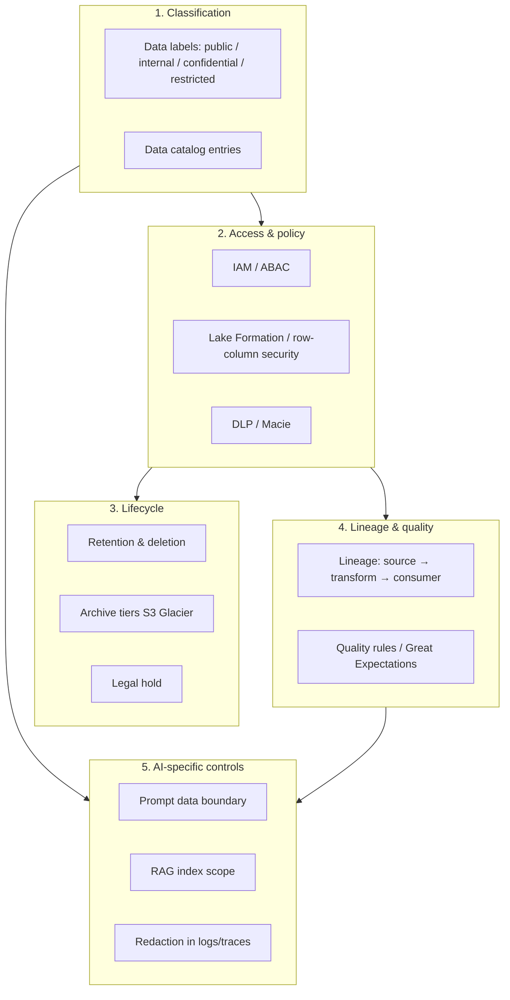

# Data Governance

Conceptual model for data classification, lifecycle, lineage, and AI usage boundaries in an AI-native enterprise stack on AWS.

> **Reference template — no production code.**  
> **Decision guide:** [Data governance layers](guides/data-governance.md) · [Identity, access & secrets](guides/identity-access-secrets.md)  
> **Related:** [AI guardrails](guides/ai-guardrails-security.md) · [SOP-010 AI usage](sops/SOP-010-ai-tool-usage.md)

---

## Why data governance matters with AI

AI tools increase **volume and speed** of data handling — in prompts, generated code, logs, and embeddings. Without governance layers:

- PII reaches model providers or logs  
- Retention exceeds legal limits  
- Teams cannot explain where data flowed (audit failure)  
- RAG indexes ingest documents at wrong classification level  

Data governance is a **cross-cutting layer**, not a single tool.

---

## Governance layer model

---

## Roles (reference)

| Role | Responsibility |
|------|----------------|
| **Data owner** | Business accountability for dataset |
| **Data steward** | Classification, glossary, quality rules |
| **Security / privacy** | DLP, regulatory mapping (GDPR, HIPAA) |
| **Platform** | Macie, Lake Formation, audit logs |
| **AIPO** | AI prompt policy, RAG scope, model audit |

See [GOVERNANCE.md](GOVERNANCE.md) for RACI alignment.

---

## Integration points

| Lifecycle phase | Governance touchpoint |
|-----------------|----------------------|
| Planning | Classify feature data in ticket ([SOP-001](sops/SOP-001-feature-intake.md)) |
| Spec / API | Document fields sensitivity in OpenAPI |
| Development | No prod data in dev/AI ([SOP-010](sops/SOP-010-ai-tool-usage.md)) |
| CI | Scan for secrets + PII patterns |
| Runtime | Encrypt at rest/transit; audit CloudTrail |
| Observability | Redact logs/traces ([monitoring-tracing-logging](guides/monitoring-tracing-logging.md)) |
| AI RAG | Index only approved classification ([knowledge-indexing](guides/knowledge-indexing-portals.md)) |
| Incident | Breach playbooks ([incident-management](guides/incident-management.md)) |

---

## Related guides

- [Data governance layers](guides/data-governance.md) — tools, alternatives, pitfalls  
- [AI guardrails & security](guides/ai-guardrails-security.md)  
- [Monitoring, tracing & logging](guides/monitoring-tracing-logging.md) — redaction in telemetry
