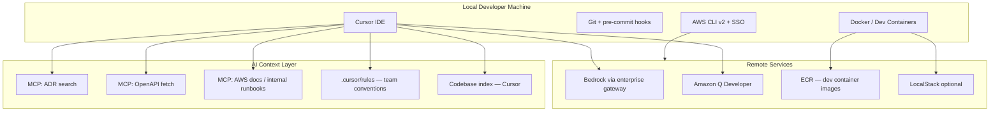
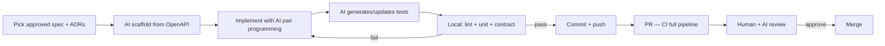

# Developer Workflow — AI-Assisted Spec-Driven Development

---
title: Developer Workflow
description: Local setup, tooling, and the day-to-day loop for AI-assisted spec-driven development on AWS.
---

Local setup, tooling, and the day-to-day loop for high-velocity AI-assisted coding on AWS.

> **Reference template — no production code in this repo.**  
> **Decision guides:** [AI coding tools](guides/ai-coding-tools.md) · [Spec-driven development](guides/spec-driven-development.md) · [Linters & static analysis](guides/static-analysis-linting.md) · [Identity, access & secrets](guides/identity-access-secrets.md)  
> **Procedures to adapt:** [SOP-004](sops/SOP-004-implementation.md) · [SOP-010](sops/SOP-010-ai-tool-usage.md) · [SOP-011](sops/SOP-011-onboarding.md)

---

## Developer Environment



---

## Onboarding Checklist

| Step | Action |
|------|--------|
| 1 | AWS SSO login; IAM role for dev account — see [Identity guide](guides/identity-access-secrets.md) |
| 2 | Clone monorepo; install pre-commit hooks |
| 3 | Open in Cursor; verify MCP servers connected |
| 4 | Read Backstage onboarding doc + relevant Accepted ADRs |
| 5 | Run `make dev` or devcontainer — local stack up |
| 6 | Run full test suite locally once to verify environment |
| 7 | Confirm linters/formatters run locally — see [Linters & static analysis](guides/static-analysis-linting.md) |

---

## Local validators (linters & static analysis)

Before every commit, developers should run the same **classic validators** CI will enforce. AI-generated code is not exempt.

| Layer | What to run locally | Reference |
|-------|---------------------|-----------|
| Format + lint | ESLint/Ruff/golangci-lint per language | [static-analysis-linting.md](guides/static-analysis-linting.md) |
| Types | `tsc`, mypy, pyright | Same guide |
| Secrets | gitleaks via pre-commit | Same guide |
| Spec changes | Spectral on touched OpenAPI files | Same guide |

Use **pre-commit** (or language equivalent) so hooks mirror CI. Config files live in **your** project repo — this template documents choices only.

**Pitfall:** Relying on Cursor "format on save" without shared team config → AI and human edits use different rules.

---

## Spec-Driven Development Loop



### Before writing code

1. Confirm feature spec status is **Approved** in `specs/`
2. Load linked Accepted ADRs into agent context (via MCP or `@docs/adr/`)
3. Identify OpenAPI operations to implement or modify
4. Run Schemathesis or contract test scaffold against spec

### During implementation ("vibe coding")

- Work operation-by-operation against the OpenAPI contract
- Let AI generate handlers, DTOs, mappers, and test cases
- Steer with natural language; anchor changes to spec operation IDs
- Run tests on save; never commit with failing local checks
- For architectural questions, ask agent to check ADR corpus first

### Before opening PR

- [ ] All spec operations implemented or explicitly deferred (ticket linked)
- [ ] Contract tests pass against OpenAPI
- [ ] No secrets in diff (pre-commit gitleaks)
- [ ] ADR reference in PR description if decision was made
- [ ] CHANGELOG or release note stub if user-facing

---

## AI Tooling Matrix

| Tool | Use case | Guardrail |
|------|----------|-----------|
| **Cursor Agent** | Multi-file features, refactors | Spec + ADR in context; rules file |
| **Cursor Tab** | Inline completion | Same repo index |
| **Amazon Q Developer** | AWS API usage, IaC | Enterprise data boundary |
| **Bedrock (Claude)** | Complex reasoning, ADR drafts | Via approved gateway; no PII in prompts |
| **MCP: ADR server** | `search_adr("event bus")` | Read-only; Accepted only |
| **MCP: Spec server** | `get_openapi("orders-v1")` | Approved specs only |
| **Bugbot / AI review** | PR first pass | Does not replace human review |

---

## Cursor Rules Example

Store team conventions in `.cursor/rules/`:

```markdown
# Architecture context
Before suggesting infrastructure or cross-service patterns, search Accepted ADRs via MCP.

# Spec-driven
Implement only against Approved OpenAPI in specs/openapi/. If spec is missing, stop and ask.

# AWS defaults
Prefer managed services: EventBridge over self-hosted Kafka unless ADR says otherwise.
Use Secrets Manager, never hardcode credentials.

# Testing
Every new handler needs: unit test, contract test against OpenAPI, integration test if DB involved.
```

---

## Dev Containers & Local AWS

Recommended `devcontainer.json` includes:

- Language runtime (Node 20, Python 3.12, etc.)
- Docker-in-Docker for Testcontainers
- AWS CLI with SSO profile mount
- pre-commit installed on postCreateCommand
- LocalStack for SQS, DynamoDB, S3 (optional)

Ephemeral AWS resources for integration tests:

- PR preview environment spun up by CI (CDK stack per branch)
- Destroyed on PR close to control cost

---

## ADR Contributions from Developers

Developers do not accept ADRs—they **propose** them:

1. Encounter architectural fork (e.g., cache strategy)
2. Ask planning agent to draft ADR with options
3. Open PR to `docs/adr/` with status `Proposed`
4. Tag architect for review
5. Continue spike work on feature branch only after architect guidance

This keeps vibe-coding velocity while preventing silent architecture drift.

---

## Anti-Patterns

| Anti-pattern | Why it hurts | Fix |
|--------------|--------------|-----|
| Code first, spec later | Contract drift, untestable AI output | Block PR without spec link |
| Skipping ADR for "small" infra choices | Compound drift | ADR template for decisions > 1 day rework |
| Pasting prod data into AI prompts | Data leak | Synthetic fixtures only |
| Ignoring AI review comments | Missed security issues | Treat AI review as required check |
| Manual testing "just to be sure" | Doesn't scale; false confidence | Add automated test instead |
