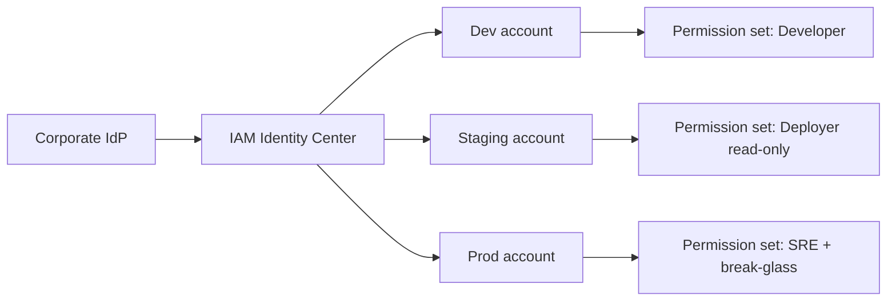
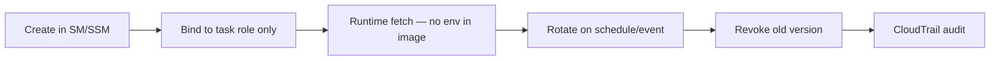

# Guide: Identity, Access & Secrets

**Decision:** How humans, CI, and services authenticate — and how credentials, keys, and permissions are scoped across environments.

Related: [identity-access-secrets.md](../identity-access-secrets.md) · [data-governance.md](data-governance.md) · [ci-cd-release.md](ci-cd-release.md) · [static-analysis-linting.md](static-analysis-linting.md) · [ai-guardrails-security.md](ai-guardrails-security.md) · [SOP-010](../sops/SOP-010-ai-tool-usage.md) · [SOP-011](../sops/SOP-011-onboarding.md) · [GOVERNANCE](../GOVERNANCE.md)

---

## Scope: three access planes

| Plane | Who | Typical controls | This guide section |
|-------|-----|------------------|-------------------|
| **Human (workforce)** | Developers, SRE, SEC, PO | SSO, IAM Identity Center, break-glass | [Workforce identity](#workforce-identity-sso--iam) |
| **Machine (CI/CD & workloads)** | Pipelines, ECS tasks, Lambda | OIDC, IAM roles, IRSA | [CI/CD & runtime IAM](#cicd--runtime-iam) |
| **Application (end users)** | Customers, internal users | RBAC, ABAC, API scopes | [Application RBAC](#application-rbac) |

**Secret scanning** (detecting keys in Git) lives in [Linters & static analysis](static-analysis-linting.md). This guide covers **storage, rotation, access, and permission design**.

---

## Workforce identity (SSO → IAM)

| Approach | Pros | Cons |
|----------|------|------|
| **IAM Identity Center (SSO) + permission sets** | Central IdP federation; per-account roles | Permission-set sprawl without governance |
| **Direct IAM users** | Simple for tiny teams | No SSO; keys on laptops; audit nightmare |
| **Cross-account role assumption** | Clear dev/staging/prod separation | Trust policy mistakes = lateral movement |
| **Just-in-time (JIT) elevation** | Reduces standing prod access | Extra tooling (e.g. IAM Identity Center + approval workflow) |

**Recommended:** IAM Identity Center → permission sets mapped to **environment accounts** (dev / staging / prod). No long-lived access keys for humans.

### Environment account pattern

| Permission set (example) | Dev | Staging | Prod |
|--------------------------|-----|---------|------|
| **Developer** | Read/write app resources | Read-only + deploy via CI only | No direct access |
| **SRE / Platform** | Full infra read | Deploy + observability | Deploy + incident break-glass |
| **Security (SEC)** | Read + GuardDuty | Read + scan configs | Read + audit; no data plane write |
| **Read-only auditor** | Read | Read | Read |

**Pitfall:** Developers with `AdministratorAccess` in prod "for debugging" — use read-only + temporary elevation with ticket audit.

---

## CI/CD & runtime IAM

| Approach | Pros | Cons |
|----------|------|------|
| **OIDC federation (GitHub Actions → AWS)** | No static CI keys; short-lived creds | Trust policy + audience tuning |
| **CodePipeline service role** | Native AWS; simple in-account | Cross-repo patterns harder |
| **Long-lived IAM user for CI** | Familiar | **Avoid** — key rotation burden, leak risk |
| **Task/instance roles (ECS, EKS IRSA, Lambda)** | Least privilege per workload | Policy per service; needs IaC discipline |
| **ABAC via resource tags** | Scales multi-team accounts | Tag hygiene; policy complexity |

**Recommended:** One org standard — **OIDC for external CI** (GitHub/GitLab) or **CodePipeline roles in-account**; workloads always use **task roles**, never instance profiles with broad `s3:*`.

### CI OIDC vs static keys

| | OIDC role | Static access key in CI secret |
|--|-----------|--------------------------------|
| Credential lifetime | Minutes | Until rotated (often never) |
| Blast radius on leak | Scoped to role + session | Full key permissions |
| AI-generated pipeline YAML risk | Still dangerous if role is too broad | Catastrophic |
| Setup cost | One-time trust + role | "Easy" day one |

See [CI/CD & release](ci-cd-release.md) for orchestrator choice; this guide owns **how CI authenticates**.

### Runtime permission model

| Workload | Pattern | Pitfall |
|----------|---------|---------|
| **ECS Fargate** | Task execution role + task role | Task role with `*` on S3/RDS |
| **EKS** | IRSA per service account | Shared namespace SA with admin |
| **Lambda** | Function execution role | One role for all functions |
| **Batch / Glue** | Job role scoped to job prefix | Cross-job data access |

**With AI:** Models generate IAM policies with `"Action": "*"` — enforce **OPA/Conftest** on IaC (see [static-analysis-linting.md](static-analysis-linting.md)) and human review for new permissions.

---

## Application RBAC

| Approach | Pros | Cons |
|----------|------|------|
| **Amazon Cognito + groups → IAM (API Gateway)** | AWS-native; JWT at edge | Cognito UX limits for complex B2B |
| **Corporate IdP (Okta, Entra) + OIDC/SAML app** | Single sign-on for workforce apps | App must map groups → roles |
| **Custom RBAC in app DB** | Flexible product roles | Easy to get wrong; test coverage critical |
| **ABAC (attributes: tenant, classification, region)** | Fine-grained multi-tenant | Policy authoring harder |
| **OPA / Cedar at API gateway** | Central policy; auditable | Latency + operational overhead |
| **AWS Verified Permissions (Cedar)** | Managed policy store | Cedar learning curve |

**Recommended starting point:**

- **Customer-facing SaaS:** IdP or Cognito for auth + **explicit RBAC model in ADR** (roles, permissions, tenant isolation).  
- **Internal tools:** Corporate SSO + group-to-role mapping.  
- **Service-to-service:** mTLS or SigV4 with **scoped IAM roles** — not shared API keys.

### RBAC design checklist (record in ADR)

| Element | Example | Pitfall |
|---------|---------|---------|
| **Roles** | `admin`, `editor`, `viewer` | Role explosion (50+ roles) |
| **Permissions** | `invoice:read`, `invoice:write` | Coarse `admin` only |
| **Scope** | Org / tenant / resource | Missing tenant boundary → data leak |
| **Default deny** | New users = no access | Default allow in generated code |
| **Audit** | Who granted role change | No log on privilege escalation |

**With AI:** Generated auth middleware often skips **authorization** while implementing **authentication** — require contract tests for forbidden paths per role.

---

## Secret management lifecycle

### Where secrets live

| Store | Best for | Pros | Cons |
|-------|----------|------|------|
| **Secrets Manager** | DB passwords, API keys, rotation | Automatic rotation hooks | Cost per secret |
| **SSM Parameter Store (SecureString)** | Config + non-rotating secrets | Cheaper; KMS-backed | Rotation manual unless scripted |
| **KMS envelope encryption** | App-level secret blobs | Strong audit | App must call KMS |
| **Git / `.env` in repo** | — | — | **Never** (scan + block) |
| **CI variables (masked)** | Build-time only | Simple | Leak via logs; not for prod DB passwords in app |

**Recommended:** Secrets Manager for **rotating credentials**; Parameter Store for **static config**; **never** plaintext in Git, tickets, or AI prompts ([SOP-010](../sops/SOP-010-ai-tool-usage.md)).

### Lifecycle stages

| Stage | Control | Owner |
|-------|---------|-------|
| **Create** | Naming convention `{env}/{service}/{name}` | SRE + service owner |
| **Read** | IAM `secretsmanager:GetSecretValue` on resource ARN | Task role only |
| **Rotate** | Lambda rotation or native RDS rotation | SRE |
| **Break-glass** | Separate emergency secret; time-bound access | SEC + SRE |
| **Detect leak** | gitleaks + GuardDuty + SM access anomalies | SEC |

### Rotation policy (example)

| Secret type | Rotation | Trigger |
|-------------|----------|---------|
| Database password | 30–90 days | Automated SM rotation |
| Third-party API key | 90 days or vendor policy | Calendar + incident |
| CI OIDC | N/A (no long-lived secret) | — |
| KMS CMK | Annual or on compromise | SEC runbook |
| JWT signing key | 90 days + overlap window | Dual-key verify period |

**Pitfall:** Rotation without **dual-active period** — app breaks at flip. Always support current + previous key during overlap.

---

## Permission matrix by lifecycle phase

Maps [GOVERNANCE](../GOVERNANCE.md) roles to **access types** (not every IAM action — adapt in your ADR).

| Phase | Human access | CI / machine access | Application RBAC |
|-------|--------------|---------------------|------------------|
| **Plan / intake** | PO, ARCH: backlog tools | — | — |
| **Define (spec, ADR)** | ARCH, SEC: Git write `docs/` | — | — |
| **Build** | DEV: dev account write | CI: build, scan, push ECR (no prod) | Dev/test tenants only |
| **Verify (PR)** | Reviewers: Git; no prod | CI: unit/integration in ephemeral account | Test roles in preview env |
| **Release** | SRE: approve T1 deploy | CD: deploy staging → prod via scoped role | Staging sign-off roles |
| **Operate** | SRE on-call: prod read + runbook actions | Workloads: task roles only | Prod user roles enforced |
| **Incident** | IC: break-glass (logged) | Rollback pipeline role | May disable features via flags |
| **Learn** | Postmortem: log/metric read | — | — |

### Deploy permission split (recommended)

| Action | Who may trigger | AWS mechanism |
|--------|-----------------|---------------|
| Merge to `main` | DEV + reviewer + green CI | Branch protection |
| Deploy staging | CI pipeline role | `deploy-staging` role |
| Deploy prod T1 | SRE approval + CI | `deploy-prod` role + manual gate |
| Deploy prod T2–3 | CI after metric gate | Same role; no human for routine |
| IAM policy change | SRE/SEC review + IaC PR | Separate `iac-admin` role |

---

## Cross-cutting controls

| Control | Purpose | Options |
|---------|---------|---------|
| **CloudTrail** | API audit | Org trail; log file validation |
| **IAM Access Analyzer** | External access findings | Enable in all accounts |
| **Permission boundaries** | Cap max permissions for roles | Platform team owns boundary policy |
| **SCP (Organizations)** | Deny list at account root | Deny `iam:*User*`, deny unapproved regions |
| **Session tags (ABAC)** | `Project=`, `Classification=` on session | Pair with [data governance Layer 2](data-governance.md) |
| **Secrets in AI** | Block `.env`, keys in prompts | [SOP-010](../sops/SOP-010-ai-tool-usage.md) |

---

## Pitfalls

| Pitfall | Why it hurts | Mitigation |
|---------|--------------|------------|
| **Shared prod DB password in Slack** | Instant breach | SM + break-glass only; DLP on chat |
| **One IAM role for all microservices** | Lateral movement | Task role per service |
| **CI admin role** | Compromised PR = prod takeover | Split build vs deploy roles |
| **RBAC only in UI, not API** | BOLA/IDOR via direct API | Contract tests per role |
| **Secrets in container env at build** | Image layer leak | Fetch at runtime from SM |
| **No offboarding** | Former employee access | SSO deprovision + SM version disable ([SOP-011](../sops/SOP-011-onboarding.md)) |
| **AI-generated `AKIA` in samples** | Real-looking keys merged | gitleaks + never commit ([static-analysis-linting.md](static-analysis-linting.md)) |
| **Permanent `AdministratorAccess` exception** | Policy theater | Time-bound [SOP-012](../sops/SOP-012-exception-handling.md) |
| **Auth without authz** | Login works; data leaks across tenants | ADR-mandated permission matrix + tests |
| **Ignoring service-linked roles** | Blind spots in audit | Document SLR usage in runbooks |

---

## Recommended starting point

1. **IAM Identity Center** with dev/staging/prod accounts and permission sets (no human access keys).  
2. **OIDC** for CI → separate **build** and **deploy** roles.  
3. **Secrets Manager** for DB/API secrets; **task roles** for runtime fetch.  
4. **gitleaks** pre-commit + CI (see linters guide).  
5. **ADR** for application RBAC model before first customer-facing API.  
6. **Phase × role matrix** above copied into your wiki; align with [GOVERNANCE](../GOVERNANCE.md) RACI.

---

## Related

- [Identity & access (topic deep dive)](../identity-access-secrets.md)  
- [Data governance — Layer 2 access](data-governance.md) · [Security perspective](../perspectives/security.md)  
- [Developer workflow](../developer-workflow.md) · [DevOps perspective](../perspectives/devops-sre.md)
