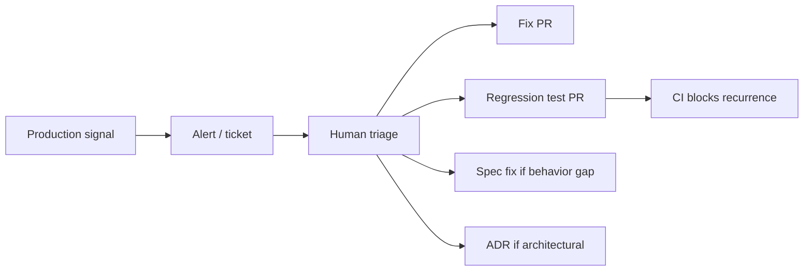

# Guide: Observability & Monitoring as QA

**Decision:** How production signals act as a **continuous QA layer** and feed planning — distinct from base instrumentation ([monitoring-tracing-logging.md](monitoring-tracing-logging.md)) and dashboards ([dashboards-reporting.md](dashboards-reporting.md)).

Related: [operations-observability.md](../operations-observability.md) · [SOP-007](../sops/SOP-007-incident-response.md) · [SOP-008](../sops/SOP-008-post-incident.md)

---

## Monitoring-as-QA vs traditional monitoring

| Traditional ops monitoring | Monitoring as QA |
|----------------------------|------------------|
| "Is it up?" | "Did this release change behavior vs contract?" |
| Page on threshold | Page on **novel** failure or SLO burn |
| Ops owns alerts | Ops + dev own **regression artifacts** |
| Fix and close | Fix + **test in CI** so it never returns |

CI catches known cases; production catches **unknown unknowns** and **integration drift**.

---

## QA-oriented patterns

| Pattern | What it catches | Pitfall if misconfigured |
|---------|-----------------|--------------------------|
| **Synthetic canaries** | User journey breaks | Shallow scripts miss API logic bugs |
| **SLO error budgets** | Slow degradation | Budget too loose → silent rot |
| **Deploy metric diff** | Release caused regression | No deploy tags → false negatives |
| **New error class detection** | Novel exceptions | Allowlist stale → noise or silence |
| **Anomaly detection** | Unknown unknowns | Alert fatigue without tuning |
| **Contract vs prod trace** | Spec behavior drift | Not comparing to OpenAPI allowlist |

---

## Stack pointer

For metrics/logs/traces/RUM/synthetics tooling choices, see **[Monitoring, tracing & logging](monitoring-tracing-logging.md)**.

For alert routing, war rooms, postmortems, see **[Incident management](incident-management.md)**.

For SLO dashboards and exec reports, see **[Dashboards & reporting](dashboards-reporting.md)**.

---

## Feedback loop to development

| Action | Owner | Pitfall |
|--------|-------|---------|
| Regression test from incident | DEV | Never filed → repeat incident |
| Spec amendment | PO/ARCH | Blame user error not spec gap |
| ADR update | ARCH | Same arch mistake twice |
| Alert tuning | SRE | Permanent mute hides bugs |

**Recommended:** Sev-1/2 requires regression test PR within defined SLA ([SOP-008](../sops/SOP-008-post-incident.md)).

---

## AI in the QA loop

| Use | Safe pattern | Pitfall |
|-----|--------------|---------|
| Log clustering during incident | Human validates clusters | Auto-remediate from AI guess |
| Draft postmortem | Human edits all sections | Publish AI text unreviewed |
| Suggest regression test | Human merges after review | Test asserts wrong behavior |
| Anomaly explanation | Label as hypothesis | Treat as root cause |

---

## Pitfalls

| Pitfall | Why it hurts | Mitigation |
|---------|--------------|------------|
| **Monitoring separate from QA mindset** | Same bug twice | Mandatory regression artifact |
| **Canaries in prod only** | Late detection | Staging synthetics pre-release |
| **No trace propagation** | Can't debug AI microservices | OpenTelemetry standard |
| **Metrics without SLOs** | Arbitrary alerts | SLI/SLO per T1 |
| **Logs without structure** | AI correlation useless | JSON + trace_id |
| **Skipping postmortem action items** | Process debt | Track to completion in ticket |

---

## Recommended starting point

Staging + prod synthetics on critical paths → deploy metric diff with auto-rollback → new-error-class alerts → post-incident regression mandatory → link incidents to spec/ADR updates when applicable.

---

## Related

- [Automated testing](automated-testing-qa.md) · [CI/CD & release](ci-cd-release.md) · [Data governance](data-governance.md)
