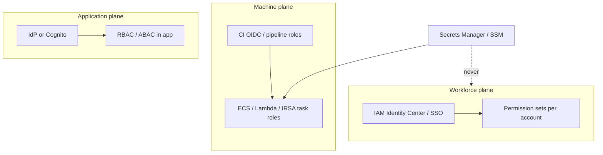
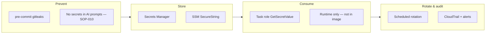

# Identity, Access & Secrets

---
title: Identity, Access & Secrets
description: Guidance on workforce identity, CI/workload IAM, application RBAC, and secret lifecycle for AWS.
---

Conceptual model for workforce identity, CI/workload IAM, application RBAC, and secret lifecycle in an AI-native enterprise stack on AWS.

> **Reference template — no production code.**  
> **Decision guide:** [Identity, access & secrets](guides/identity-access-secrets.md)  
> **Related:** [Data governance](data-governance.md) · [AI guardrails](guides/ai-guardrails-security.md) · [CI/CD topic](cicd-observability.md) · [GOVERNANCE](GOVERNANCE.md)

---

## Why this is separate from data governance

[Data governance](data-governance.md) focuses on **what data is** (classification, lineage, retention). This topic focuses on **who and what may act** (humans, pipelines, services, end users) and **how credentials are stored and rotated**.

AI increases risk in all three planes: developers paste secrets into prompts, generated IaC grants `"Action": "*"`, and auth code often ships without authorization tests.

---

## Three access planes

| Plane | Question it answers | Primary AWS tools |
|-------|---------------------|-------------------|
| **Workforce** | Which engineer can touch which account? | IAM Identity Center, permission sets, CloudTrail |
| **Machine** | Which pipeline/workload can deploy or read data? | OIDC, IAM roles, KMS, SCPs |
| **Application** | Which end user can perform which action? | Cognito, API Gateway authorizers, Verified Permissions |

Full option comparisons: [Guide: Identity, access & secrets](guides/identity-access-secrets.md).

---

## Secret lifecycle (reference model)

Secrets flow through **detection**, **storage**, **consumption**, and **rotation** — not a single tool.

| Layer | Reference in this repo |
|-------|-------------------------|
| Detect in Git | [Linters guide](guides/static-analysis-linting.md) · [SOP-005](sops/SOP-005-pr-review.md) |
| Policy (no paste to AI) | [SOP-010](sops/SOP-010-ai-tool-usage.md) |
| Runtime storage | [CI/CD topic](cicd-observability.md) · [Developer workflow](developer-workflow.md) |
| Rotation & break-glass | [Identity guide](guides/identity-access-secrets.md) |

---

## Permission matrix (summary)

Align IAM and RBAC with [GOVERNANCE](GOVERNANCE.md) decision rights. Expand in your ADR.

| Role | Dev account | Staging | Prod data plane | Prod deploy |
|------|-------------|---------|-----------------|-------------|
| **DEV** | Read/write app | Read; deploy via CI | No direct access | No |
| **ARCH** | Read + design | Read | Read logs/specs | Consult T1 |
| **SRE** | Infra read/write | Deploy | Operate + incident | **Accountable** T1 |
| **SEC** | Security read | Scan configs | Audit read | Consult |
| **PO** | — | Staging validate | No | Informed |
| **CI (build)** | Build, test, scan | — | — | No |
| **CI (deploy)** | — | Deploy | Deploy via gate | T1 manual approval |

Application **end-user** roles (customer RBAC) are defined per product ADR — see guide checklist.

---

## Integration with delivery phases

| Phase | Access focus |
|-------|--------------|
| **Plan** | Classify whether feature needs new roles/secrets |
| **Define** | Threat model includes IAM blast radius; ADR documents RBAC |
| **Build** | Task roles in IaC; no secrets in repo |
| **Verify** | Secret scan gate; OPA on IAM policies; authz tests |
| **Release** | Deploy roles only in CD; KMS keys per env |
| **Operate** | Access Analyzer, GuardDuty, SM access anomalies |
| **Learn** | Postmortem: was excess permission a factor? |

Role-specific views: [Security perspective](perspectives/security.md) · [DevOps perspective](perspectives/devops-sre.md) · [Developer perspective](perspectives/developer.md).

---

## Quick links

| Need | Go to |
|------|-------|
| Compare IdP / Cognito / custom RBAC | [Guide § Application RBAC](guides/identity-access-secrets.md#application-rbac) |
| CI OIDC vs static keys | [Guide § CI/CD & runtime IAM](guides/identity-access-secrets.md#cicd--runtime-iam) |
| Secret rotation policy | [Guide § Secret management lifecycle](guides/identity-access-secrets.md#secret-management-lifecycle) |
| Phase × role permissions | [Guide § Permission matrix](guides/identity-access-secrets.md#permission-matrix-by-lifecycle-phase) |
| Scanning only (not storage) | [Linters & static analysis](guides/static-analysis-linting.md) |
