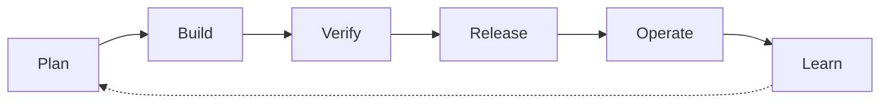

# Delivery lifecycle

Every artifact in this reference template maps to one phase of the delivery cycle. Use these hubs as the **spine** of the documentation — not a flat list of pages.

## Phases

| Phase | You deliver | Hub |
|-------|-------------|-----|
| **Plan** | Prioritized intake, classification, ADRs, approved specs | [Plan →](./plan) |
| **Build** | Spec-driven code, AI-assisted implementation, IaC | [Build →](./build) |
| **Verify** | Automated tests, scans, human PR review | [Verify →](./verify) |
| **Release** | CI/CD, staging sign-off, progressive prod deploy | [Release →](./release) |
| **Operate** | Monitoring, incidents, SLOs, on-call | [Operate →](./operate) |
| **Learn** | Postmortems, regression, governance updates | [Learn →](./learn) |

## Cross-cutting (all phases)

| Topic | Where |
|-------|--------|
| AI tool & data policy | [SOP-010](../sops/SOP-010-ai-tool-usage) · [AI guardrails](../guides/ai-guardrails-security) |
| Knowledge & ADR discovery | [Knowledge indexing](../guides/knowledge-indexing-portals) |
| Human decision gates | [Human-in-the-loop](../guides/human-in-the-loop-governance) · [GOVERNANCE](../GOVERNANCE) |
| Identity & secrets | [Identity guide](../guides/identity-access-secrets) |

## Other entry points

- [Choose by role](../perspectives/) · [Choose by pillar](../pillars/) · [Adoption roadmap](../adoption-roadmap)
