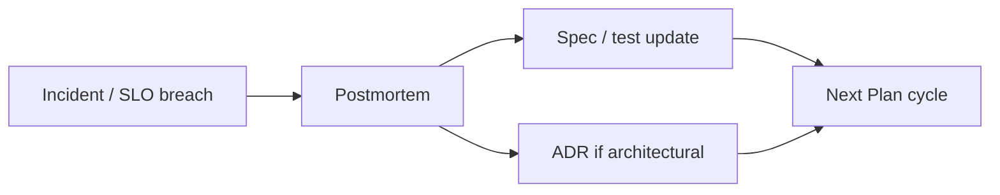

# Learn

**Outcome:** Systemic improvements — tests, specs, ADRs, and process updated from production truth.

## Goals

- Blameless postmortems with closed action items  
- Sev-1/2 → regression artifact within 48h  
- SLO/alert tuning from error budgets  
- Governance and human-gate review when patterns repeat

## Key roles

| Role | Accountable for |
|------|-----------------|
| **SRE** | Postmortem facilitation, action tracking |
| **DEV** | Regression tests, spec fixes |
| **EM / ARCH** | Process and ADR updates |

→ [Team lead perspective](../perspectives/team-lead) · [Scrum Master perspective](../perspectives/scrum-master)

## Decision guides

- [Observability & monitoring QA](../guides/observability-monitoring-qa)  
- [Human-in-the-loop & governance](../guides/human-in-the-loop-governance)

## Reference SOPs

| SOP | Procedure |
|-----|-----------|
| [SOP-008](../sops/SOP-008-post-incident) | Post-incident |

## Feedback loop to Plan

## Also read

- [GOVERNANCE](../GOVERNANCE) — artifact lifecycle, decision rights  
- [Adoption roadmap](../adoption-roadmap) — iterate your operating model over time

---

[← Operate](./operate) · [Lifecycle overview](./index) · [Plan →](./plan)
