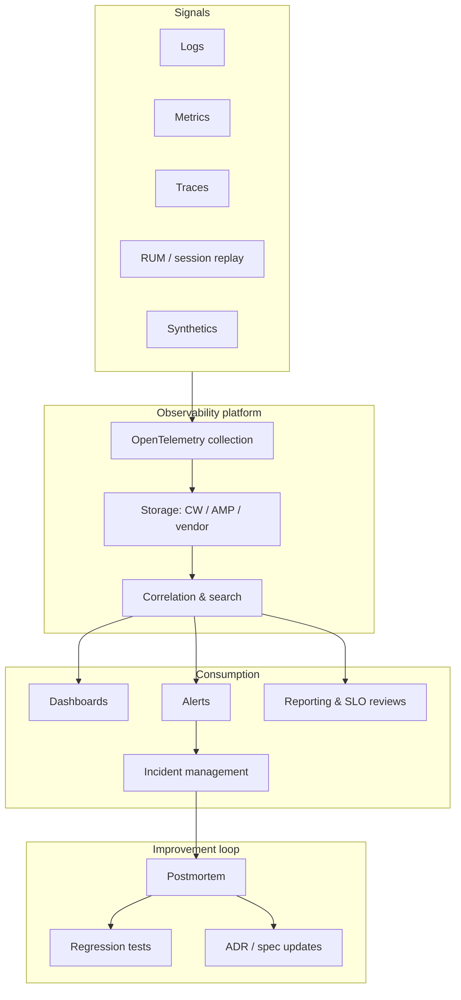

# Operations, Observability & Incidents

Umbrella view of runtime operations: signals, dashboards, incidents, and reporting — separate from but connected to **monitoring-as-QA**.

> **Reference template — no production code.**

---

## Operations stack (conceptual)

---

## Guide map

| Topic | Guide | Focus |
|-------|-------|-------|
| **Metrics, logs, traces** | [monitoring-tracing-logging.md](guides/monitoring-tracing-logging.md) | Instrumentation, OpenTelemetry, AWS vs vendor |
| **Monitoring as QA** | [observability-monitoring-qa.md](guides/observability-monitoring-qa.md) | Deploy diff, synthetics, feedback to dev |
| **Dashboards** | [dashboards-reporting.md](guides/dashboards-reporting.md) | Golden signals, SLO views, exec reporting |
| **Incidents** | [incident-management.md](guides/incident-management.md) | PagerDuty, severity, comms, runbooks |
| **Data in telemetry** | [data-governance.md](guides/data-governance.md) | Redaction, classification in logs/traces |

---

## Topic doc

| Doc | Contents |
|-----|----------|
| [cicd-observability.md](cicd-observability.md) | CI/CD pipeline + post-deploy monitoring hooks |
| [data-governance.md](data-governance.md) | Data governance layer model |

---

## Reference SOPs

| SOP | Process |
|-----|---------|
| [SOP-006](sops/SOP-006-release-deploy.md) | Post-deploy baselines |
| [SOP-007](sops/SOP-007-incident-response.md) | Incident response |
| [SOP-008](sops/SOP-008-post-incident.md) | Postmortem & regression |
