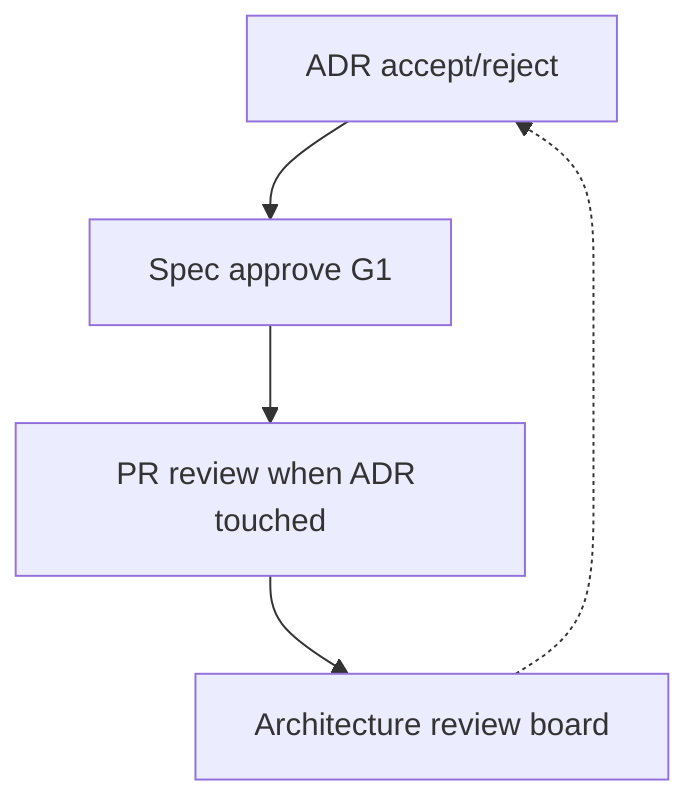

# Architect perspective

**Lens:** **Technical coherence** — ADRs, API contracts, tiers, cross-service design, and human approval of AI-drafted architecture.

## Phase by phase

| Phase | Your job | Key artifacts | Guides & SOPs |
|-------|----------|---------------|-----------------|
| **Plan** | Feasibility; tier validation | Architecture flags on intake | [SOP-001](../sops/SOP-001-feature-intake) |
| **Define** | **Accept ADRs**; co-approve specs | Accepted ADRs, approved OpenAPI | [Planning & ADR](../guides/planning-adr-specs) · [SOP-002](../sops/SOP-002-adr-lifecycle) · [SOP-003](../sops/SOP-003-spec-approval) |
| **Build** | Consult on forks; reject silent drift | Proposed ADRs from devs | [Knowledge indexing](../guides/knowledge-indexing-portals) |
| **Verify** | Review PRs touching ADR/spec/IaC | ARCH approval on PR | [SOP-005](../sops/SOP-005-pr-review) |
| **Release** | T1 prod deploy approval | Deploy gate | [SOP-006](../sops/SOP-006-release-deploy) |
| **Operate** | Architectural incidents | ADR updates | [SOP-008](../sops/SOP-008-post-incident) |
| **Learn** | Supersede ADRs; ARB themes | ADR corpus health | [SOP-009](../sops/SOP-009-artifact-publish) |

## Your gates

| Gate | Authority |
|------|-----------|
| **G1 Define** | ADR `accepted`; spec approved |
| **G3 Release (T1)** | Co-approve prod with SRE |
| **ARB** | Cross-team conflicts |

## AI-specific responsibilities

- Never allow **Proposed** ADRs in agent index  
- Review AI-drafted ADRs for **real options**, not rubber-stamp  
- Ensure specs link ADRs (`x-adr`) for traceability  
- Planning agent must retrieve **Accepted** ADRs before new drafts  

Deep dive: [Planning & ADR topic](../planning-and-adr) · [Architecture overview](../ARCHITECTURE)

## Pitfalls (Architect view)

| Pitfall | Mitigation |
|---------|------------|
| ADR theater | One decision per ADR; enforce status |
| Skipping ADR for "small" AI infra choices | ADR if >1 day rework |
| Wiki as architecture source | Git canonical |
| Letting AI accept its own ADRs | Human status change only |

[← All roles](./index)
