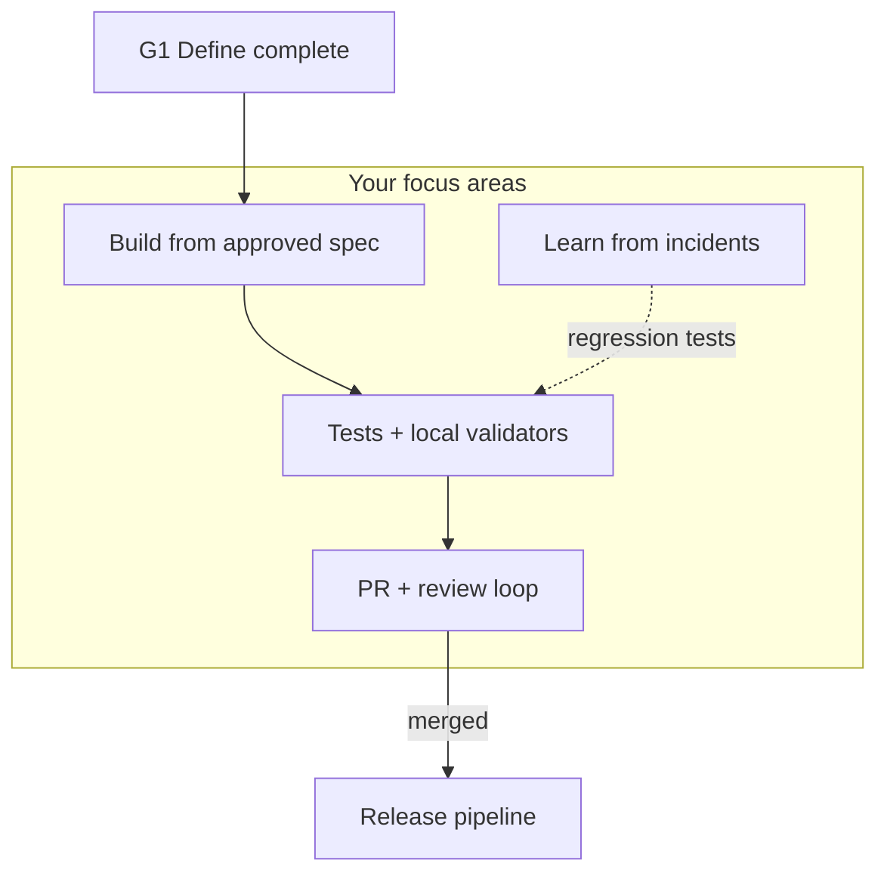

# Developer perspective

**Lens:** Turn approved specs into merged, tested code — fast, with AI assistance, within guardrails.

## Phase by phase

| Phase | Your job | Key artifacts | Guides & SOPs |
|-------|----------|---------------|-----------------|
| **Plan** | Estimate; flag `needs-adr` / `needs-spec` | Story with acceptance criteria | [SOP-001](../sops/SOP-001-feature-intake) |
| **Define** | Review OpenAPI; propose ADRs if blocked | Approved spec, Accepted ADRs | [Spec-driven dev](../guides/spec-driven-development) · [SOP-003](../sops/SOP-003-spec-approval) |
| **Build** | AI-assisted impl; contract tests | PR, linked ticket | [AI coding tools](../guides/ai-coding-tools) · [SOP-004](../sops/SOP-004-implementation) |
| **Verify** | Fix CI; respond to review | Green pipeline | [Linters](../guides/static-analysis-linting) · [SOP-005](../sops/SOP-005-pr-review) |
| **Release** | Support deploy failures | Release notes stub | [CI/CD guide](../guides/ci-cd-release) |
| **Operate** | On-call rotation (if applicable) | Runbook updates | [Incident mgmt](../guides/incident-management) |
| **Learn** | Regression tests from Sev-1/2 | Postmortem actions | [SOP-008](../sops/SOP-008-post-incident) |

## Daily loop

1. Confirm spec is **approved** and ADRs **accepted** before coding  
2. Load spec + ADRs in Cursor (MCP / `@` references)  
3. Implement operation-by-operation; AI generates tests from OpenAPI  
4. Run pre-commit: format, lint, types, secrets  
5. Open PR with spec link, ADR IDs, tier label  

Deep dive: [Developer workflow](../developer-workflow)

## Who you collaborate with

| Role | When |
|------|------|
| **Architect** | API shape, ADR proposals |
| **QA lead** | Test design in PR (not manual execution) |
| **DevOps/SRE** | Pipeline failures, preview envs |
| **PO** | Spec ambiguity only — not implementation direction |
| **Security** | If scan flags or data-handling questions |

## Pitfalls (developer view)

| Pitfall | Mitigation |
|---------|------------|
| Coding before spec approved | Wait for G1; amend spec first |
| Trusting AI output blindly | Review + CI guardrails |
| Skipping contract tests | 100% of touched OpenAPI ops |
| Prod data in AI prompts | Synthetic fixtures only — [SOP-010](../sops/SOP-010-ai-tool-usage) |

[← All roles](./index)
