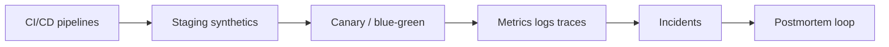

# DevOps / SRE perspective

**Lens:** Safe, observable paths to production — pipelines, deploy gates, telemetry, and incident response.

## Phase by phase

| Phase | Your job | Key artifacts | Guides & SOPs |
|-------|----------|---------------|-----------------|
| **Plan** | Flag infra/ops cost; tier validation | Tier in ticket | [Runtime AWS](../guides/runtime-aws) |
| **Define** | Review IaC impact in ADRs | ADR with ops trade-offs | [SOP-002](../sops/SOP-002-adr-lifecycle) |
| **Build** | Maintain CI; ephemeral PR envs | Pipeline config (in **your** repo) | [CI/CD](../guides/ci-cd-release) · [Identity & secrets](../guides/identity-access-secrets) · [Linters](../guides/static-analysis-linting) |
| **Verify** | Ensure scan gates enforced | CI policy | [SOP-005](../sops/SOP-005-pr-review) |
| **Release** | Deploy; metric gate; rollback | Change record | [SOP-006](../sops/SOP-006-release-deploy) |
| **Operate** | On-call; SLOs; synthetics | Dashboards, alerts | [Monitoring](../guides/monitoring-tracing-logging) · [Dashboards](../guides/dashboards-reporting) · [SOP-007](../sops/SOP-007-incident-response) |
| **Learn** | Postmortem; alert tuning; baselines | Action items closed | [SOP-008](../sops/SOP-008-post-incident) · [Monitoring as QA](../guides/observability-monitoring-qa) |

## Accountabilities

- **T1 prod deploy** approval (with ARCH)  
- **Incident commander** for Sev-1/2  
- **SLO definitions** and error budgets  
- **Pipeline health** and deploy freeze on budget burn  

Deep dive: [Operations & observability](../operations-observability) · [CI/CD topic](../cicd-observability)

## Who you collaborate with

| Role | When |
|------|------|
| **Developer** | Failed pipelines, hotfix deploys |
| **Architect** | T1 deploy, cross-service blast radius |
| **PO** | Staging green but wrong product — escalate to PO not QA scripts |
| **Security** | GuardDuty, policy exceptions |
| **Program manager** | Cross-team release trains |

## Pitfalls (DevOps view)

| Pitfall | Mitigation |
|---------|------------|
| Deploy without metric gate | Auto-rollback on canary |
| Alert fatigue | SLO-based paging only for T1 |
| Staging ≠ prod parity | Same container, scaled infra |
| Monitoring without runbooks | Every T1 alert links runbook |

[← All roles](./index)
