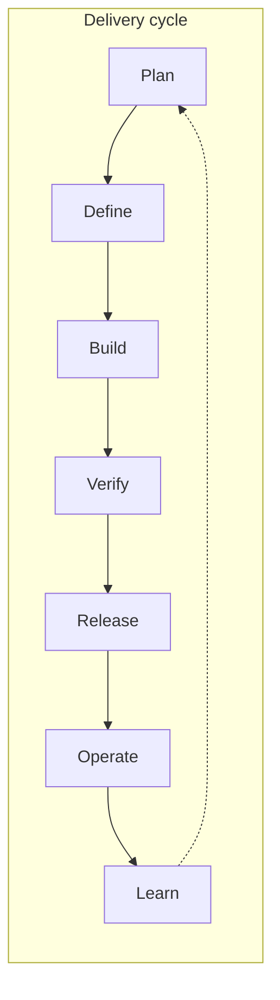

# Development cycle by role

The same lifecycle looks different depending on where you sit. Use this section to see **what matters to you**, **when you engage**, and **which guides and SOPs apply**.

## Pick your role

| Role | You care most about… | Start here |
|------|----------------------|------------|
| [Developer](./developer) | Spec-driven implementation, AI tools, PR quality | [Developer perspective →](./developer) |
| [DevOps / SRE](./devops-sre) | CI/CD, deploy safety, observability, incidents | [DevOps perspective →](./devops-sre) |
| [QA / Quality lead](./qa) | Automated verification, guardrails, monitoring-as-QA | [QA perspective →](./qa) |
| [Product manager / PO](./product-manager) | Intake, acceptance criteria, staging sign-off | [Product perspective →](./product-manager) |
| [Scrum master](./scrum-master) | Flow, ceremonies, blockers, DoD | [Scrum Master perspective →](./scrum-master) |
| [Program manager](./program-manager) | Cross-team dependencies, milestones, risk | [Program Manager perspective →](./program-manager) |
| [Team lead / EM](./team-lead) | Capacity, review throughput, escalations | [Team Lead perspective →](./team-lead) |
| [Architect](./architect) | ADRs, contracts, tiers, ARB | [Architect perspective →](./architect) |
| [Security](./security) | Data classification, scans, AI policy, exceptions | [Security perspective →](./security) |

## Phase × role matrix

Quick map of **primary involvement** (● = accountable · ○ = consulted · — = informed)

| Phase | Dev | DevOps | QA | PM/PO | Scrum | Program | TL/EM | Arch | Sec |
|-------|:---:|:------:|:--:|:-----:|:-----:|:-------:|:-----:|:----:|:---:|
| **Plan** | ○ | ○ | ○ | ● | ○ | ● | ○ | ○ | ○ |
| **Define** | ○ | ○ | ○ | ● | ○ | ○ | ○ | ● | ○ |
| **Build** | ● | ○ | ○ | — | ○ | ○ | ○ | ○ | ○ |
| **Verify** | ● | ○ | ● | — | ○ | — | ○ | ○ | ○ |
| **Release** | ○ | ● | ○ | ● | ○ | ○ | ● | ○ | ○ |
| **Operate** | ○ | ● | ○ | — | ○ | ○ | ○ | ○ | ○ |
| **Learn** | ● | ● | ● | ○ | ○ | ● | ● | ● | ○ |

Legend: **●** primary owner for that phase in this model · **○** active participant · **—** kept informed

## Shared gates (all roles)

| Gate | Phase | Human approvers |
|------|-------|-----------------|
| G0 Intake | Plan | PO |
| G1 Define | Define | ARCH + PO |
| G2 Build | Verify | Reviewer + CI |
| G3 Release | Release | SRE (T1: + ARCH); PO staging |
| G4 Operate | Operate | SRE on-call |
| G5 Learn | Learn | SRE + DEV (+ ARCH if systemic) |

Details: [Governance](../GOVERNANCE) · [Process overview](../processes/overview)

## How to use this section

1. Open **your role page** for a phase-by-phase checklist and diagram  
2. Follow links into **decision guides** for tool choices (pros/cons/pitfalls)  
3. Use **SOPs** as reference playbooks to adapt in your organization  

This is a **reference lens**, not a RACI you must copy — adjust for your org size and compliance tier.
