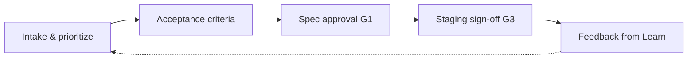

# Product manager / PO perspective

**Lens:** **What** gets built and **why** — prioritized backlog, clear acceptance criteria, approved specs, and staging behavior validation.

## Phase by phase

| Phase | Your job | Key artifacts | Guides & SOPs |
|-------|----------|---------------|-----------------|
| **Plan** | Prioritize; business outcome; tier input | Scored backlog item | [SOP-001](../sops/SOP-001-feature-intake) |
| **Define** | **Approve** acceptance criteria & spec intent | Approved OpenAPI + BDD | [Planning & ADR specs](../guides/planning-adr-specs) · [SOP-003](../sops/SOP-003-spec-approval) |
| **Build** | Available for spec clarifications — not daily direction | Answered questions in ticket | — |
| **Verify** | Informed of PR merge; no manual test pass | — | — |
| **Release** | **Staging sign-off** (T1/T2 user-facing) | Demo + green synthetics | [SOP-006](../sops/SOP-006-release-deploy) |
| **Operate** | Customer comms input on Sev-1/2 | Status page messaging | [Incident mgmt](../guides/incident-management) |
| **Learn** | Spec amendments if behavior gap | Updated spec PR | [SOP-008](../sops/SOP-008-post-incident) |

## Your gates

| Gate | Decision |
|------|----------|
| **G0 Intake** | Priority and readiness for define |
| **G1 Define** | Co-approve spec with ARCH |
| **G3 Release** | Staging matches intent (not a QA script — demo + metrics) |

## Who you collaborate with

| Role | When |
|------|------|
| **Architect** | Spec shape, cross-team APIs |
| **Scrum Master** | Flow blockers on define phase |
| **Program manager** | Cross-team priority conflicts |
| **Developer** | Clarify AC — not how to code |
| **QA lead** | Testability of AC at define time |

## Pitfalls (PM view)

| Pitfall | Mitigation |
|---------|------------|
| Skipping spec approval to "go faster" | G1 blocks implementation |
| UAT meeting instead of staging sign-off | Structured demo + synthetics |
| Changing AC after merge without spec PR | Amend spec first |
| Prioritizing without tier/data classification | SEC/DATA consult on sensitive features |

[← All roles](./index)
