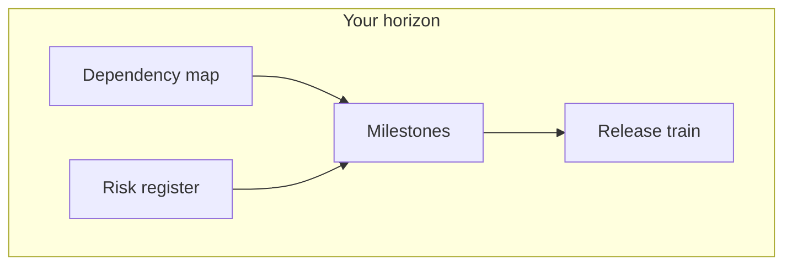

# Program Manager perspective

**Lens:** **Coordination at scale** — dependencies, milestones, release trains, and risk across multiple teams sharing the same lifecycle gates.

## Phase by phase

| Phase | Your job | Key artifacts | Guides & SOPs |
|-------|----------|---------------|-----------------|
| **Plan** | Cross-team priority alignment | Portfolio backlog | [SOP-001](../sops/SOP-001-feature-intake) |
| **Define** | Dependency on shared ADRs/specs | Shared API contracts | [Planning & ADR](../guides/planning-adr-specs) |
| **Build** | Track blocked teams waiting on G1 | Dependency board | — |
| **Verify** | Integration milestone dates | Cross-team E2E window | [Automated testing](../guides/automated-testing-qa) |
| **Release** | Release train calendar | Coordinated deploy order | [CI/CD](../guides/ci-cd-release) · [SOP-006](../sops/SOP-006-release-deploy) |
| **Operate** | Major incident stakeholder comms | Program status report | [Incident mgmt](../guides/incident-management) |
| **Learn** | Trend: repeat cross-team failures | Program retro | [SOP-008](../sops/SOP-008-post-incident) |

## Metrics you track

| Metric | Why |
|--------|-----|
| ADR time-to-accept (cross-team) | Define-phase bottleneck |
| % work starting before G1 | Process debt |
| Cross-service integration test pass rate | Contract discipline |
| Sev-1 count by program increment | Quality trend |
| Error budget burn by service | Release readiness |

## Who you collaborate with

| Role | When |
|------|------|
| **POs** | Priority conflicts across teams |
| **Architect / ARB** | Shared platform decisions |
| **Team leads** | Capacity and milestone slips |
| **DevOps** | Release train windows |
| **Security / compliance** | Regulated release gates |

## Pitfalls (Program Manager view)

| Pitfall | Mitigation |
|---------|------------|
| Forcing shared deadline without shared spec | No G1 → no start |
| Hiding team-level quality debt | Escaped defect roll-up |
| Big-bang integration week | Continuous contract tests |
| Ignoring data governance on cross-team data flows | [Data governance](../guides/data-governance) early |

[← All roles](./index)
