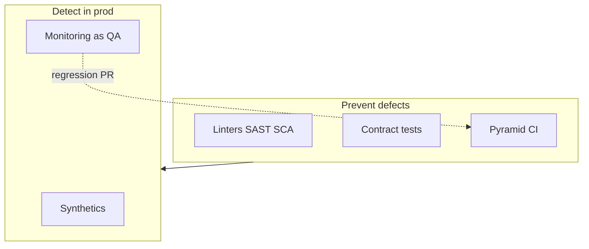

# QA / Quality lead perspective

**Lens:** Quality enforced by **automation** — test pyramid, static analysis, CI gates, and production feedback loops. No manual test execution phase.

## Phase by phase

| Phase | Your job | Key artifacts | Guides & SOPs |
|-------|----------|---------------|-----------------|
| **Plan** | Clarify testability of acceptance criteria | Testable AC in story | [SOP-001](../sops/SOP-001-feature-intake) |
| **Define** | Review BDD; contract test strategy | Gherkin + OpenAPI | [Spec-driven dev](../guides/spec-driven-development) |
| **Build** | Review AI-generated **test design** in PRs | Test quality in review | [Automated testing](../guides/automated-testing-qa) |
| **Verify** | Own CI quality gates policy | Gate thresholds by tier | [Linters](../guides/static-analysis-linting) · [SOP-005](../sops/SOP-005-pr-review) |
| **Release** | Confirm staging synthetics green | Smoke evidence | [SOP-006](../sops/SOP-006-release-deploy) |
| **Operate** | Monitor-as-QA alerts; escaped defect tracking | Incident → test link | [Observability as QA](../guides/observability-monitoring-qa) |
| **Learn** | Mandate regression tests Sev-1/2 | Merged regression PR | [SOP-008](../sops/SOP-008-post-incident) |

## What QA does **not** do in this model

- Manual regression passes or UAT script execution  
- Sign-off after running test cases by hand  

## What QA **does** do

- Define and tune **automated** gate policy  
- Meta-review test **design** in PRs  
- Track **escaped defects** and close the loop to CI  
- Partner with SRE on **monitoring-as-QA** patterns  

Deep dive: [QA & guardrails](../qa-guardrails)

## Pitfalls (QA view)

| Pitfall | Mitigation |
|---------|------------|
| Reintroducing manual QA "just in case" | Automate the check instead |
| AI tests from implementation | Generate from OpenAPI |
| Weak mutation scores on T1 | Tier-based mutation floor |
| Ignoring prod alerts as "ops only" | Escaped defect process |

[← All roles](./index)
