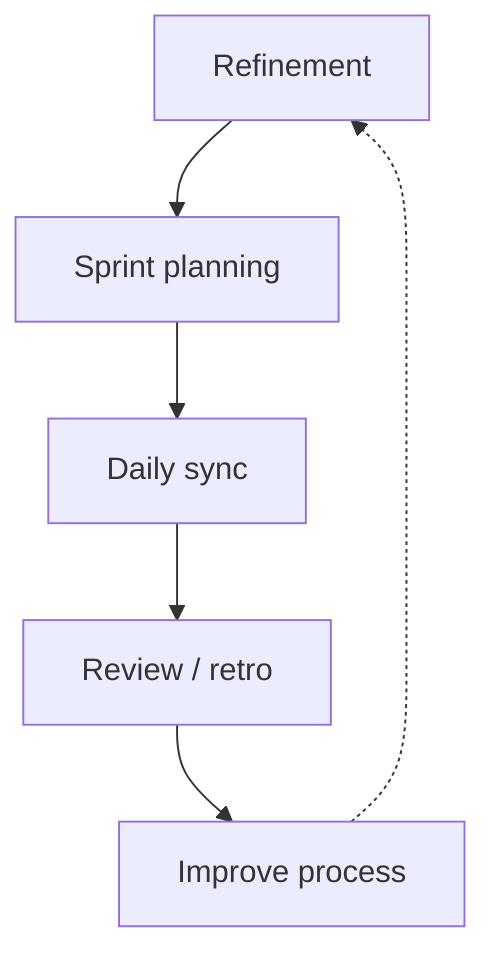

# Scrum Master perspective

**Lens:** **Flow and predictability** — remove blockers, protect gates without bypassing them, align ceremonies to the AI-native model.

## Phase by phase (ceremony mapping)

| Cycle phase | Ceremonies you facilitate | Watch for |
|-------------|---------------------------|-----------|
| **Plan** | Backlog refinement | Items without tier or AC |
| **Define** | Spec/ADR review scheduling | ADR backlog > 3 days |
| **Build** | Daily standup | Coding before G1 unlock |
| **Verify** | PR review SLA | Review queue > 1 day |
| **Release** | Deploy readiness | Missing PO staging sign-off |
| **Operate** | Incident retro scheduling | Sev-1 without postmortem date |
| **Learn** | Retrospective actions | Repeat process gaps |

## Definition of Done (reference)

Adapt for your team; example checklist:

- [ ] Linked approved spec + Accepted ADRs  
- [ ] All CI gates green for tier  
- [ ] Human PR approval  
- [ ] PO staging sign-off (if user-facing)  
- [ ] No open SEC Critical findings  

## Blockers you escalate

| Blocker | Escalate to |
|---------|-------------|
| ADR stuck > SLA | ARCH / ARB |
| Review queue stale | Team lead / EM |
| CI flaky main | DevOps + DEV |
| Spec/PO disagreement | EM + ARCH |
| Policy exception needed | SEC via [SOP-012](../sops/SOP-012-exception-handling) |

## AI-era coaching points

- **Don't** measure velocity by lines of AI-generated code  
- **Do** measure cycle time from G1 unlock → merge  
- **Don't** skip gates for "AI will fix it in prod"  
- **Do** time-box spikes; require ADR if pattern sticks  

Deep dive: [Process overview](../processes/overview) · [Human-in-the-loop](../guides/human-in-the-loop-governance)

## Pitfalls (Scrum Master view)

| Pitfall | Mitigation |
|---------|------------|
| Pressure to bypass spec for sprint commitment | Re-scope, don't skip G1 |
| Retro actions without owners | Track like production bugs |
| Standups become status for PM only | Focus on blockers to gates |

[← All roles](./index)
