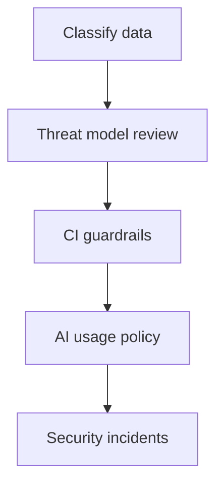

# Security perspective

**Lens:** **Trust boundaries** — data in AI prompts, scan gates, threat models, incidents, and policy exceptions.

## Phase by phase

| Phase | Your job | Key artifacts | Guides & SOPs |
|-------|----------|---------------|-----------------|
| **Plan** | Data classification on intake | Class label on ticket | [Data governance](../guides/data-governance) · [SOP-001](../sops/SOP-001-feature-intake) |
| **Define** | Threat model review (T1/T2 external) | STRIDE outline | [Planning & ADR](../guides/planning-adr-specs) |
| **Build** | SAST/SCA/secrets policy | Scan thresholds | [Linters](../guides/static-analysis-linting) · [AI guardrails](../guides/ai-guardrails-security) · [Identity & secrets](../guides/identity-access-secrets) |
| **Verify** | Block Critical; exception process | [SOP-012](../sops/SOP-012-exception-handling) | [SOP-005](../sops/SOP-005-pr-review) |
| **Release** | DAST on staging; container CVEs | Scan report | [CI/CD](../guides/ci-cd-release) |
| **Operate** | GuardDuty; breach playbooks | Security incident | [Incident mgmt](../guides/incident-management) |
| **Learn** | Postmortem for Sev-1 security | Policy update | [SOP-008](../sops/SOP-008-post-incident) |

## Non-negotiables

| Rule | Reference |
|------|-----------|
| No prod PII in AI prompts | [SOP-010](../sops/SOP-010-ai-tool-usage) |
| No merge on Critical secret scan | [SOP-005](../sops/SOP-005-pr-review) |
| Restricted data never in coding-agent RAG | [Data governance](../guides/data-governance) |
| Security exceptions time-bound | [SOP-012](../sops/SOP-012-exception-handling) |

## Who you collaborate with

| Role | When |
|------|------|
| **AIPO** | AI platform audit, Bedrock logging |
| **Data steward** | Classification glossary |
| **Architect** | Security ADRs |
| **DevOps** | WAF, IAM, GuardDuty, Secrets Manager | [Identity guide](../guides/identity-access-secrets) |
| **Legal/privacy** | Breach and erasure |

## Pitfalls (Security view)

| Pitfall | Mitigation |
|---------|------------|
| Consumer AI tools for code | Enterprise tier only |
| Permanent scan exceptions | Max 30d + remediation |
| Logs with full PII | Redaction standards |
| AI RCA on malware in public models | Isolated analysis |

[← All roles](./index)
