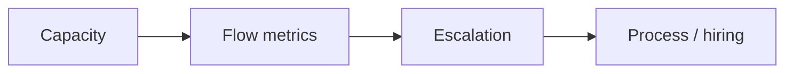

# Team Lead / Engineering Manager perspective

**Lens:** **Team health and throughput** — sustainable pace, review capacity, hiring/onboarding, and escalation when gates stall.

## Phase by phase

| Phase | Your job | Key artifacts | Guides & SOPs |
|-------|----------|---------------|-----------------|
| **Plan** | Capacity vs commitment | Sprint/PI capacity | [SOP-001](../sops/SOP-001-feature-intake) |
| **Define** | Ensure ARCH bandwidth for ADRs | ARB queue | [Governance](../GOVERNANCE) |
| **Build** | Protect focus; AI tool compliance | Team conventions | [AI coding tools](../guides/ai-coding-tools) · [SOP-010](../sops/SOP-010-ai-tool-usage) |
| **Verify** | Review assignment; stale PR SLA | Review rotation | [SOP-005](../sops/SOP-005-pr-review) |
| **Release** | T1 deploy approval (with SRE) | Deploy calendar | [SOP-006](../sops/SOP-006-release-deploy) |
| **Operate** | On-call fairness; burnout | Rotation schedule | [SOP-007](../sops/SOP-007-incident-response) |
| **Learn** | Postmortem culture; action closure | Team retro themes | [SOP-008](../sops/SOP-008-post-incident) |

## Metrics you own

| Metric | Target direction |
|--------|------------------|
| PR cycle time (median) | Down |
| Main branch CI pass rate | Up (>95%) |
| Review queue age | Down (<1 day) |
| ADR/spec block time | Down |
| Escaped defects | Down quarter-over-quarter |

## Escalation paths you own

| Issue | Action |
|-------|--------|
| Review bottleneck | Assign reviewers; reduce WIP |
| Gate bypass pressure | Reinforce G1/G2 with leadership |
| Non-security exception | Approve via [SOP-012](../sops/SOP-012-exception-handling) |
| Repeat incidents | Resource postmortem actions |

## Onboarding

New engineers: [SOP-011](../sops/SOP-011-onboarding) · [Developer workflow](../developer-workflow)

## Pitfalls (Team Lead view)

| Pitfall | Mitigation |
|---------|------------|
| Hero culture on incidents | Rotate; blameless postmortems |
| Unlimited AI tool sprawl | Standardize + SEC policy |
| Skipping onboarding on AI policy | Day 1 acknowledgment |
| Measuring output by commits | Outcome + flow metrics |

[← All roles](./index)
