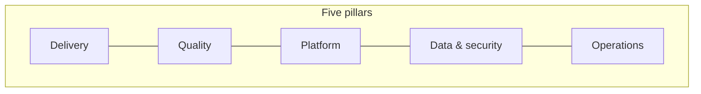

# Content pillars

Use **pillars** when the lifecycle phase is not the right entry — e.g. "everything about security" spans Plan through Operate.

| Pillar | Concern | Hub |
|--------|---------|-----|
| **Delivery** | Planning, specs, AI-assisted coding, governance | [Delivery →](./delivery) |
| **Quality** | Testing, linters, guardrails, monitoring-as-QA | [Quality →](./quality) |
| **Platform** | CI/CD, runtime AWS, deploy mechanics | [Platform →](./platform) |
| **Data & security** | Classification, IAM, secrets, AI data policy | [Data & security →](./data-security) |
| **Operations** | Observability, dashboards, incidents | [Operations →](./operations) |

## vs lifecycle

| Navigate by… | When |
|--------------|------|
| [Lifecycle](../lifecycle/) | "What happens in this phase?" |
| **Pillars** | "Everything about this concern" |
| [Role](../perspectives/) | "What do I care about?" |
