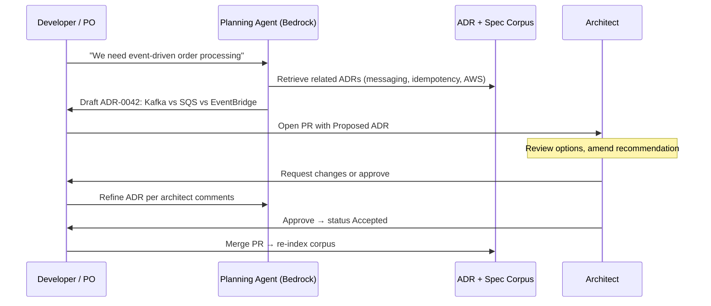
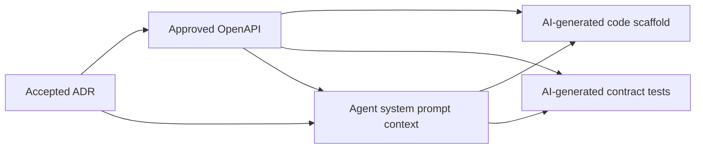

# Planning & Architecture Decision Records

How AI integrates into enterprise planning, how ADRs are drafted and shared, and where humans retain decision authority.

> **Reference template — no production code in this repo.**  
> **Decision guide:** [Planning, ADR & specs](guides/planning-adr-specs.md) · [Knowledge indexing](guides/knowledge-indexing-portals.md)  
> **Procedures to adapt:** [SOP-002](sops/SOP-002-adr-lifecycle.md) · [SOP-003](sops/SOP-003-spec-approval.md) · [SOP-009](sops/SOP-009-artifact-publish.md)

---

## Planning Process Overview

```mermaid
flowchart TB
    subgraph Intake["1. Intake"]
        REQ[Business requirements]
        CONSTRAINTS[Non-functional requirements]
        EXISTING[Existing ADRs + system context]
    end

    subgraph AIPlan["2. AI-Assisted Planning"]
        DRAFT_SPEC[Draft feature spec + OpenAPI skeleton]
        DRAFT_ADR[Draft ADR(s) with options analysis]
        DRAFT_THREAT[Draft threat model outline]
        DRAFT_TEST[Draft test strategy from acceptance criteria]
    end

    subgraph Review["3. Human Review Gates"]
        PO_REVIEW[PO: acceptance criteria]
        ARCH_REVIEW[Architect: ADR + API design]
        SEC_REVIEW[Security: threat model]
    end

    subgraph Publish["4. Publish & Index"]
        MERGE[Merge to main]
        INDEX[Index in OpenSearch/Kendra]
        PORTAL[Publish to Backstage TechDocs]
    end

    subgraph Implement["5. Implementation Unlock"]
        UNLOCK[Spec status → Approved]
        AGENTS[AI coding agents consume context]
    end

    REQ --> DRAFT_SPEC
    CONSTRAINTS --> DRAFT_SPEC
    EXISTING --> DRAFT_ADR
    DRAFT_SPEC --> DRAFT_ADR
    DRAFT_SPEC --> DRAFT_THREAT
    DRAFT_SPEC --> DRAFT_TEST

    DRAFT_ADR --> ARCH_REVIEW
    DRAFT_SPEC --> PO_REVIEW
    DRAFT_SPEC --> ARCH_REVIEW
    DRAFT_THREAT --> SEC_REVIEW

    ARCH_REVIEW --> MERGE
    PO_REVIEW --> MERGE
    SEC_REVIEW --> MERGE
    MERGE --> INDEX --> PORTAL
    MERGE --> UNLOCK --> AGENTS
```

---

## ADR Lifecycle

| Status | Meaning | AI context | Human action |
|--------|---------|------------|--------------|
| **Proposed** | AI or human drafted, under review | Not indexed | Architect reviews |
| **Accepted** | Decision ratified | Indexed for RAG | None — implementation proceeds |
| **Rejected** | Decision not adopted | Not indexed | Archive with rationale |
| **Superseded** | Replaced by newer ADR | Old removed from index | Link to successor ADR |
| **Deprecated** | Still valid history, no longer guidance | Warning in retrieval | Optional migration plan |

### ADR template (MADR-compatible)

Each ADR in `docs/adr/NNNN-title.md` includes:

1. **Title and status**
2. **Context** — problem and constraints (AI can draft from requirements)
3. **Decision drivers** — quality attributes, NFRs
4. **Considered options** — minimum two, with pros/cons (AI generates; human validates)
5. **Decision outcome** — chosen option and rationale
6. **Consequences** — positive, negative, risks
7. **Links** — related ADRs, specs, tickets

---

## AI in ADR Drafting



**Prompting guidelines for ADR agents:**

- Always retrieve existing Accepted ADRs before proposing new ones
- Flag conflicts with prior decisions
- Include AWS-specific cost and operational trade-offs
- Never auto-accept — output status is always `Proposed`

---

## Sharing Non-Production Artifacts

ADRs, specs, threat models, and runbooks are **knowledge artifacts**. They require a different delivery model than application code.

### Git as source of truth

```
repo/
├── docs/
│   └── adr/
│       ├── 0001-record-architecture-decisions.md
│       ├── 0042-order-event-bus.md
│       └── README.md          # index with status table
├── specs/
│   ├── openapi/
│   │   └── orders-v1.yaml
│   └── asyncapi/
│       └── order-events.yaml
└── .cursor/
    └── rules/
        └── adr-context.mdc    # points agents to ADR index
```

### Publication pipeline (on merge to `main`)

| Step | Action | AWS service |
|------|--------|-------------|
| 1 | Validate ADR format, broken links | CodeBuild |
| 2 | Build static site (MkDocs / Docusaurus) | CodeBuild |
| 3 | Upload to S3 | S3 |
| 4 | Serve via CDN | CloudFront |
| 5 | Sync to Backstage TechDocs | Backstage plugin |
| 6 | Re-index for RAG | OpenSearch Ingestion / Kendra |

### Discovery surfaces

| Surface | Audience | Purpose |
|---------|----------|---------|
| **Backstage** | All engineers | Browse services, ADRs, specs, runbooks |
| **Static ADR site** | Architects, auditors | Read-only ADR history |
| **OpenSearch/Kendra** | AI agents | Semantic retrieval at plan/code time |
| **MCP server** | Cursor / IDE | `search_adr`, `get_spec` tools |
| **PR comments** | Reviewers | Inline ADR discussion before merge |

### Why not Confluence-only?

Confluence is fine as a **mirror**, but Git must be canonical:

- Version control and PR review for ADR changes
- ADRs stay close to code and specs in the monorepo
- CI can block merge if ADR status is wrong or links break
- AI agents read from indexed Git content, not stale wiki copies

Optional: GitHub Action syncs Accepted ADRs to Confluence for PM/non-dev stakeholders.

---

## Human-in-the-Loop: Planning Phase

| Decision | Who | AI role |
|----------|-----|---------|
| Business priority | PO | Summarize impact, estimate complexity |
| API contract shape | Architect + senior dev | Draft OpenAPI from stories |
| Technology choice | Architect | Draft ADR with options |
| Security posture | Security engineer | Draft threat model |
| Test strategy | Tech lead | Draft test plan from spec |
| Go/no-go for implementation | Architect | Check ADR + spec completeness |

**Hard rule:** No feature branch for production code until linked spec is `Approved` and relevant ADRs are `Accepted`.

---

## Integration with Spec-Driven Development



Each OpenAPI operation should reference ADR IDs in its `description` or `x-adr` extension field so traceability is machine-readable.

Example:

```yaml
paths:
  /orders:
    post:
      summary: Create order
      x-adr: ["0042-order-event-bus", "0015-idempotency-keys"]
      description: |
        Creates an order and publishes OrderCreated to EventBridge per ADR-0042.
```

---

## Metrics for Planning Health

| Metric | Target | Signal |
|--------|--------|--------|
| ADR time-to-accept | < 3 business days | Planning bottleneck |
| Spec approval before first PR | 100% | Spec-driven discipline |
| ADR retrieval hit rate in agent logs | > 80% for arch changes | Context is working |
| Superseded ADR cleanup | < 30 days | Knowledge debt |
