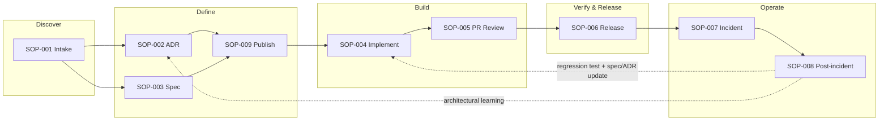

# Process Overview

---
title: Process Overview
description: Reference value stream mapping lifecycle phases to processes and SOPs.
---

**Reference value stream** — map phases to your toolchain. Pitfalls and tool alternatives live in [decision guides](../guides/README.md).

---

## Value stream

---

## Process catalog

| ID | Process | Trigger | Primary output | SLA |
|----|---------|---------|----------------|-----|
| [SOP-001](../sops/SOP-001-feature-intake.md) | Feature intake | New epic/story | Scored backlog item + planning ticket | 2 business days to triage |
| [SOP-002](../sops/SOP-002-adr-lifecycle.md) | ADR lifecycle | Architectural fork | Accepted ADR in Git | ≤ 3 days to accept |
| [SOP-003](../sops/SOP-003-spec-approval.md) | Spec approval | Feature ready to define | Approved OpenAPI + BDD | ≤ 5 days draft → approved |
| [SOP-004](../sops/SOP-004-implementation.md) | Implementation | Implementation unlocked | PR-ready code + tests | Team sprint commitment |
| [SOP-005](../sops/SOP-005-pr-review.md) | PR review & merge | PR opened | Merged commit on main | ≤ 1 business day review |
| [SOP-006](../sops/SOP-006-release-deploy.md) | Release & deploy | Merge to release branch | Prod deployment + smoke green | Tier-dependent |
| [SOP-007](../sops/SOP-007-incident-response.md) | Incident response | Alert / page | Mitigated service + ticket | T1: 15m ack |
| [SOP-008](../sops/SOP-008-post-incident.md) | Post-incident | Sev-1/2 resolved | Postmortem + regression PR | Postmortem ≤ 5 days |
| [SOP-009](../sops/SOP-009-artifact-publish.md) | Artifact publish | Merge ADR/spec to main | Indexed + portal updated | ≤ 15 min post-merge |
| [SOP-010](../sops/SOP-010-ai-tool-usage.md) | AI tool usage | Daily development | Compliant AI-assisted output | Continuous |
| [SOP-011](../sops/SOP-011-onboarding.md) | Engineer onboarding | New hire | Dev env + portal access | Day 1–5 |
| [SOP-012](../sops/SOP-012-exception-handling.md) | Exception handling | Gate blocked | Documented exception | SEC: 1 day; other: 2 days |

---

## Phase gates (summary)

| Gate | Entry criteria | Exit criteria | Human approver |
|------|----------------|---------------|----------------|
| **G0 — Intake** | Business request logged | Priority + tier assigned | PO |
| **G1 — Define** | G0 complete | Spec `approved`, ADRs `accepted` | ARCH + PO |
| **G2 — Build** | G1 complete (`implementation-unlocked`) | PR passes all CI checks | DEV reviewer |
| **G3 — Release** | G2 merged | Staging synthetics green | PO (staging), SRE (prod T1) |
| **G4 — Operate** | G3 complete | SLOs green 24h | Automated |
| **G5 — Learn** | Sev-1/2 incident | Regression merged + postmortem | SRE |

---

## Cadence

| Ceremony | Frequency | Participants | Purpose |
|----------|-----------|--------------|---------|
| Backlog refinement | Weekly | PO, ARCH, DEV | Feed SOP-001 |
| Architecture review | Weekly | ARCH, SEC, SRE | ADR decisions (SOP-002) |
| Deploy review | Daily (T1) / on-demand | SRE, DEV | SOP-006 approvals |
| SLO review | Weekly | SRE, ARCH | Tune alerts, baselines |
| AI governance | Monthly | AIPO, SEC, ARCH | Prompt policy, audit sampling |

---

## RACI quick reference

See [GOVERNANCE.md](../GOVERNANCE.md) for full matrix. Rule of thumb:

- **PO** owns *what* and accepts staging behavior
- **ARCH** owns *how* across services (ADRs, contracts)
- **DEV** owns *delivery* within approved bounds
- **SRE** owns *production safety* (deploy, incidents, SLOs)
- **SEC** owns *trust* (data in AI, policy exceptions)
- **AIPO** owns *AI platform* (models, MCP, audit)
