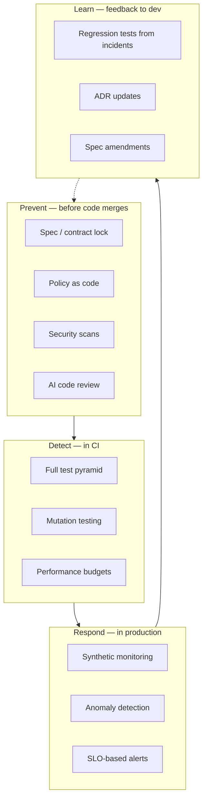
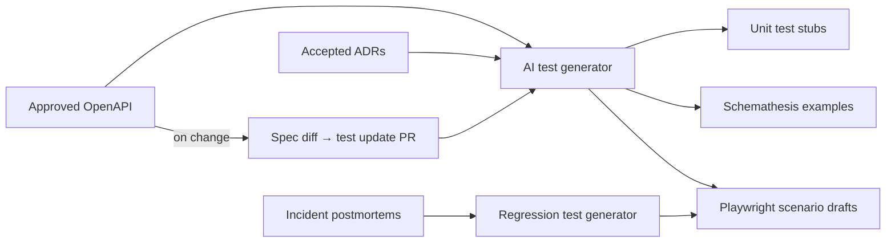
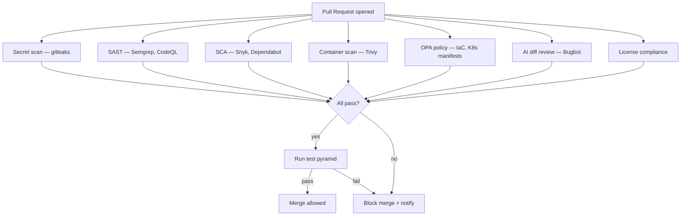

# QA & AI Guardrails — Automated Quality Only

Quality assurance is fully automated for test **execution**. Humans review test **design** in PRs and accept staging behavior — see [GOVERNANCE.md](GOVERNANCE.md).

> **Reference template — no production code in this repo.**  
> **Decision guides:** [Automated testing & QA](guides/automated-testing-qa.md) · [Linters & static analysis](guides/static-analysis-linting.md) · [AI guardrails](guides/ai-guardrails-security.md) · [Identity, access & secrets](guides/identity-access-secrets.md)  
> **Procedures to adapt:** [SOP-005](sops/SOP-005-pr-review.md) · [SOP-008](sops/SOP-008-post-incident.md)

---

## Quality Model



---

## Static analysis & linters (classic validators)

Tests verify **behavior**; linters and static analyzers verify **shape, style, types, and known-bad patterns**. Both are required — especially with AI-generated code.

Full tool comparison, CI placement, and pitfalls: **[Guide: Linters & static analysis](guides/static-analysis-linting.md)**

| Category | Examples | Run when |
|----------|----------|----------|
| **Linters** | ESLint, Ruff, golangci-lint | pre-commit + CI |
| **Formatters** | Prettier, Black, Ruff format | pre-commit + CI |
| **Type checkers** | `tsc`, mypy, pyright | pre-commit + CI |
| **SAST** | Semgrep, CodeQL, Bandit | CI |
| **SCA** | Dependabot, Snyk, Inspector | CI on lockfile changes |
| **Secret scan** | gitleaks, GitGuardian | pre-commit + CI |
| **IaC scan** | Checkov, CDK Nag, Conftest | CI on IaC changes |
| **Container scan** | Trivy, ECR scan | CI build + deploy |
| **Spec lint** | Spectral | CI on OpenAPI changes |

AI PR review does **not** replace these checks — it stacks on top ([static-analysis-linting.md](guides/static-analysis-linting.md)).

---

## Automated Test Pyramid

All layers run in CI. No manual test execution.

| Layer | Scope | Tools | When |
|-------|-------|-------|------|
| **Unit** | Functions, classes | pytest, jest, go test | Every PR |
| **Contract** | API vs OpenAPI | Pact, Schemathesis, Dredd | Every PR |
| **Integration** | DB, queues, AWS | Testcontainers, LocalStack | Every PR |
| **E2E** | User journeys | Playwright, Cypress (headless) | PR + nightly |
| **Mutation** | Test effectiveness | Stryker, mutmut, cargo-mutants | Nightly / release |
| **Property-based** | Edge cases | Hypothesis, fast-check, QuickCheck | Critical domains |
| **Performance** | Latency budgets | k6, Artillery | Release branch |
| **Chaos** | Resilience | AWS FIS, Litmus | Scheduled |

---

## AI Test Enrichment



### AI test generation rules

1. Generate tests **from spec**, not from implementation (avoids testing the bug)
2. Include negative cases: invalid input, auth failure, timeout
3. Tag tests with OpenAPI operation ID for traceability
4. Human reviewer spot-checks AI-generated tests in PR (not manual execution)
5. Mutation score threshold gates merge on critical services (e.g., > 80%)

---

## AI Guardrails (Pre-Merge)



### Guardrail categories

| Category | Examples | Block merge on |
|----------|----------|----------------|
| **Secrets** | AWS keys, tokens in diff | Any finding |
| **SAST** | SQL injection, SSRF patterns | High/Critical |
| **SCA** | Known CVE in dependencies | Critical (configurable) |
| **Container** | OS package CVEs | Critical |
| **Policy** | Public S3 bucket, open SG | Any violation |
| **AI review** | Logic errors, missing error handling | Team policy (warn or block) |
| **License** | GPL in proprietary bundle | Policy violation |

---

## Policy as Code

Store policies in `policy/` and evaluate in CI with OPA or Cedar:

```rego
# Example: deny public RDS
deny[msg] {
    input.resource_type == "aws_db_instance"
    input.publicly_accessible == true
    msg := "RDS instances must not be publicly accessible (ADR-0012)"
}
```

Link policies to ADRs in deny messages so developers understand the **why**.

---

## No manual test execution

Manual QA scripts and regression checklists are replaced by CI and synthetics. Humans still:

- Review AI-generated test quality in PRs (meta-review, not execution)
- Accept product behavior on staging via demo + green synthetics ([SOP-006](sops/SOP-006-release-deploy.md))
- Triage production alerts ([SOP-007](sops/SOP-007-incident-response.md))

| Removed | Replaced by |
|---------|-------------|
| Manual test pass | E2E + synthetic canaries |
| Exploratory testing sprint | Property-based + mutation testing |
| Manual regression checklist | Full CI suite on every PR |
| UAT meeting | PO staging sign-off |
| Per-release manual security review | SAST/SCA/DAST in pipeline |

---

## Quality Gates by Service Tier

| Tier | Example | Mutation threshold | Manual prod approval | Chaos frequency |
|------|---------|-------------------|---------------------|-----------------|
| **Tier 1** | Payments, auth | 85% | Required | Weekly |
| **Tier 2** | Core business APIs | 75% | Automatic canary | Monthly |
| **Tier 3** | Internal tools | 60% | Automatic | Quarterly |

---

## Metrics

| Metric | Target |
|--------|--------|
| CI pass rate (main) | > 95% |
| Mean time to fix broken main | < 2 hours |
| Mutation score (Tier 1) | > 85% |
| Contract test coverage of OpenAPI ops | 100% |
| Critical CVE in prod | 0 |
| Escaped defects (prod bugs without prior alert) | Trending down |
